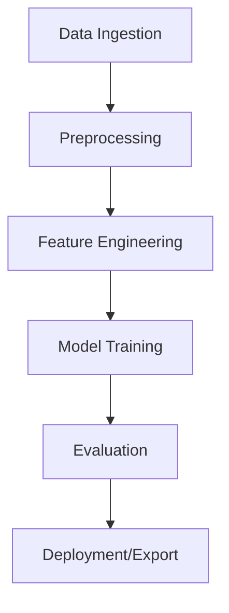

# UPA-F Development Manual (Expanded)

---

## Product Overview: Purpose, Audience & Goals

**What we are trying to do (mission)**
- Build a reliable, transparent, and continuously-updating **college football pricing engine** that:
  - Synthesizes **team fundamentals** (WRPS, Talent, SRS, SOS) with **market lines** (FanDuel preferred) and **live context** (scores).
  - Produces **actionable, auditable predictions** (model vs. market) with quantified **edge** and **confidence**.
  - Publishes results to a **static site** (GitHub Pages) with accompanying **debug artifacts** so issues can be diagnosed quickly.
- Operate under **deterministic, reproducible** workflows: every CI run **rebuilds all data**, validates freshness, and **fails hard** on emptiness/staleness.

**Who we are doing it for (audience & stakeholders)**
- **Primary users:** UPA maintainers/analysts who need trustworthy edges to guide selections and quickly debug data issues when things look off.
- **Secondary users:** Technical contributors who evolve the model, add features, maintain integrations, and improve deployment/observability.
- **Tertiary consumers:** Potential downstream dashboards/bots that ingest `data/*.csv` to trigger alerts or produce external views.

**Why this approach**
- Betting markets move; **staleness** and **missing markets** silently destroy value. We explicitly defend against both with **freshness guards**, **backfill**, and **validation gates**.
- Most failures are plumbing, not math. By shipping **debug files** (schedule, market_debug, unmatched, backfill summary) we shorten MTTD/MTTR.
- Static hosting + CI keeps ops simple, secure, and cheap while still giving near-real-time updates on every push.

---

## Personas & Top Use Cases

**Personas**
- *Analyst*: wants ranked edges with clear confidence; needs to understand **why** an edge exists and whether inputs are trustworthy today.
- *Engineer*: maintains collectors, cache logic, and CI; needs reproducible runs, strong logs, and failing builds when data is bad.
- *Modeler*: experiments with feature weights and algorithms; needs quick iteration and clear checkpoints/artifacts for evaluation.

**Use Cases**
1. **Daily update**: Kick CI; regenerate schedule/markets/predictions; validate; publish.
2. **Slate review**: Sort by `value_points_book`; inspect `qualified_edge_flag`; drill into `market_unmatched.csv` if coverage drops.
3. **Debug a mismatch**: Compare `market_debug.csv` vs `upa_predictions.csv` join keys; inspect `nan_reason` and `status.json`.
4. **Model tuning**: Adjust κ, λ, α-weights; re-run; compare MAE/RMSE and realized error on completed games.
5. **Incident response**: Validation fails → halt deploy; use debug artifacts to locate source (schedule stale, market empty, token missing).

---

## Success Criteria & KPIs

**Reliability KPIs**
- **Data freshness**: `cfb_schedule.csv` extends ≥ today+2 (ET); FanDuel lines < 48h old on active slates.
- **Coverage**: ≥ 90% predictions with numeric `market_spread_book` in-season.
- **Build health**: 100% of deploy runs pass validation or fail early; no “green” deploys with empty data.

**Quality KPIs**
- **MAE(model, market)**: monitored weekly; aim for stability with improvements after feature releases.
- **Unmatched rate**: `market_unmatched.csv`/total market rows ≤ 3%; spikes trigger alias review.
- **Synthetic market rate**: ≤ 5% during normal operation (outside emergencies).

**Velocity KPIs**
- CI end-to-end duration: target &lt; 10 minutes with warm caches.
- Time to debug: &lt; 30 minutes to root-cause via `status.json` + debug CSVs.

---

## Non‑Goals (for clarity)

- Arbitrage execution, portfolio management, staking automation: **out of scope** here.
- Live in-game pricing: **out of scope** (we snapshot pregame markets).
- Non-FBS data products: excluded from this pipeline (keeps mapping clean).

---

## Operating Constraints & Assumptions

- **Environment**: Runs in GitHub Actions on Ubuntu; Python 3.11; Node 20 for UI.
- **APIs/Quotas**: CFBD bearer token required; Odds API keys required for FanDuel; caches limit calls.
- **Idempotency**: Re-running a build with same inputs should reproduce outputs (modulo live-market timestamp changes).
- **Year scoping**: `.cache_cfbd/<year>`, `.cache_odds/<year>` to prevent cross-year bleed.
- **Documentation hygiene**: Any change that touches collectors, workflows, data schemas, or UI consumption **must** update this document in the same change set so the manual stays authoritative.

---

## Data Governance, Secrets & Security

- **Secrets**: Stored in repo secrets (`CFBD_BEARER_TOKEN`, `ODDS_API_KEY`) only; never in code or logs.
- **PII**: None handled; only public sports data; still treat tokens as sensitive.
- **Artifact integrity**: Only `dist/` (site) is published; `data/` is copied into `dist/data/` at build-time.
- **Reproducibility**: All inputs & transforms are materialized to CSV/JSON with exact schemas; changes must be versioned and documented.

---

## Environments & Config

- **Local**: Developers can run `collect_cfbd_all.py` with tokens to reproduce CI outputs into local `data/`.
- **CI (build)**: Always regenerates all artifacts; hard validation blocks deploy on failure.
- **Prod (Pages)**: Static site; data shipped alongside UI as `dist/data/*.csv|.json`.

**Configuration surface**
- `MARKET_SOURCE` (default `fanduel`), `YEAR`, κ, λ, α-weights, thresholds (`τ_points`, `τ_conf`), cache TTLs.
- All tunables defined in Python constants or env vars; changes must be reflected in `development.md`.

---

## Release, Deploy & Change Management

- **Release cadence**: As‑needed; each push to `main` is a potential deploy.
- **Validation gate**: Build fails if schedule stale, predictions empty, or market debug empty.
- **Observability**: Status page shows counts, MAE, coverage, synthetic rate, and links to debug artifacts.
- **Rollbacks**: Revert commit; CI redeploys with restored data generation.

---

## Ops Runbook (MTTD/MTTR)

1. **UI shows zeros / 404s**  
   - Check GitHub Action logs for **validation failure**; open `status.json`, `market_debug.json`.
   - Verify `data/` contents in artifact; ensure files exist in `dist/data/`.
2. **Schedule stuck at old date**  
   - Freshness guard should refetch; if not, confirm `CFBD_BEARER_TOKEN` present; inspect `.cache_cfbd/<year>`.
3. **Markets missing**  
   - Confirm `ODDS_API_KEY`; check `market_unmatched.csv`; review team alias normalizer.
4. **Predictions empty**  
   - Ensure predictions builder is present; verify joins; check `nan_reason` distribution.
5. **Frequent cache misses or API throttling**  
   - Audit cache keys; raise TTLs conservatively; reduce redundant calls.

---

## Roadmap (High Confidence Next Steps)

- Implement real **portal_net_0_100** from transfer portal data.
- Finalize in-repo **build_predictions_for_year** with confidence model.
- Add **build_live_edge_report** and formalize edge/value distribution checks.
- Expand **validation** to require minimum **coverage** on slate days.
- Add **alerting** on validation failures (GitHub Issue/Slack webhook).

---

## Risks & Mitigations

- **Upstream API instability** → Cache with sane TTLs, retry with backoff, and clear fallbacks; surface via `status.json`.
- **Name/alias drift** → Centralize canonicalization; unit tests for alias tables; monitor `market_unmatched.csv`.
- **Sign convention mistakes** → Enforce conversions at ingress; unit tests for edge/expected calculations.
- **Silent partial data** → Hard validation in CI; visible coverage metrics on Status page; never deploy empty headers only (except explicit placeholders).

## Repository Structure


### Key Directories
- `src/`: Source code for all pipeline components.
- `data/raw/`: Unmodified input data.
- `data/processed/`: Cleaned/feature-engineered data.
- `artifacts/`: Model checkpoints and evaluation reports.
- `logs/`: All logs (info, debug, errors).
- `tests/`: Unit and integration tests.
- `.github/workflows/`: CI/CD definitions.

---

## Pipeline Overview

The UPA-F pipeline is a modular, reproducible data science workflow:

1. **Data Ingestion**: Fetches and validates raw data from local files, databases, or remote APIs.
2. **Preprocessing**: Cleans, transforms, and normalizes data, handling missing values and outliers.
3. **Feature Engineering**: Constructs new features, temporal statistics, and encodings.
4. **Model Training**: Fits a predictive model (default: XGBoost) using training data.
5. **Evaluation**: Produces metrics, error analysis, and visualizations.
6. **Deployment/Export**: Saves model and predictions for downstream use.

---

## Data Artifacts

| Artifact                | Location             | Description                               |
|-------------------------|---------------------|-------------------------------------------|
| Raw Data                | `data/raw/`         | Original, unmodified input data           |
| Processed Data          | `data/processed/`   | Cleaned and feature-engineered data       |
| Model Checkpoints       | `artifacts/models/` | Trained model weights and configs         |
| Evaluation Reports      | `artifacts/reports/`| Metrics, plots, and error analysis        |
| Logs                    | `logs/`             | Execution, debug, and error logs          |

## Caching Strategy & Retention Policy

This section documents **what we cache**, **where it lives**, **how long it lives (TTL)**, **how to invalidate it**, and **how CI keys interact with on-disk caches**. It also includes do/don’t guidance to avoid accidentally nuking backtest caches.

### 1) Cache Layers (overview)

We use **two distinct cache layers**:

1. **Local/Workspace caches (filesystem):**
   - CFBD: `.cache_cfbd/<year>/...` (JSON blobs keyed by request, e.g., schedule/games endpoints)
   - Odds/FanDuel: `.cache_odds/<year>/...` (JSON/CSV snapshots keyed by event/date/book)
   - Purpose: *Reduce upstream API calls within a run and across runs on the same runner.*
   - Lives in the repo workspace during CI (ephemeral VM) and also works for local developers.

2. **GitHub Actions cache (artifact cache):**
   - Restored via `actions/cache@v4`, paths:
     - `.cache_cfbd/2025`
     - `.cache_odds/2025`
   - Keyed with a **composite key** that includes:
     - OS + `MARKET_SOURCE` + season + a **version suffix** (we bump to bust),
     - Hash of critical collector code (e.g., `hashFiles('agents/collect_cfbd_all.py')`).
   - Purpose: *Warm-start subsequent CI runs with the latest good local/workspace caches.*

> **Important:** These layers are additive. Filesystem caches are the raw objects; the Actions cache simply persists those directories across workflows keyed by our strategy.

---

### 2) Default TTLs & Freshness Rules

- **CFBD (`.cache_cfbd/<year>`)**
  - **Soft TTL:** ~90 days for static endpoints (teams, SRS, historical season endpoints).
  - **Freshness gate for schedule:** we **ignore** schedule caches if `max(date) < (today_Eastern + 2 days)` or if total rows `< 200`.
    - This is not a time-based TTL; it’s a **content freshness** rule that **forces a refetch** if the schedule is too short or ends too early.
  - **Reset events:** season rollover (August), schema changes to schedule loader, or widespread API corrections.

- **Odds/FanDuel (`.cache_odds/<year>`)**
  - **TTL:** 2 days (configurable via `ODDS_CACHE_TTL_DAYS`, default 2).
  - We prefer **fresh lines** (< 48 hours) on active slates; CI validation requires that `market_debug.csv` is **non-empty**; if empty due to staleness, the build fails.
  - **Reset events:** book availability changes, mapping logic updates, or alias table revisions.

> **Backtest note:** Backtest caches can be retained far longer since historical endpoints are immutable; favor **year-scoped dirs** to isolate them from live-season caches.

---

### 3) When To Reset (Playbook)

Reset caches when any of the following happens:

- **Stale schedule symptoms**: UI shows “stuck” week; last predictions date is 10–15 days old; CI warns schedule stale → **reset CFBD cache**.
- **FanDuel mismatch**: `market_debug.csv` empty while lines are clearly live; `market_unmatched.csv` spikes → **reset Odds cache**.
- **Alias/table updates**: You change canonicalization/regex rules → reset **both** Odds + any derived joins.
- **Schema changes**: You add/remove columns in loaders → bump Actions cache **version suffix**.
- **Season rollover**: Start of a new season (July/August) → create **new year directories** and **new Actions cache keys**.
- **Bug in cache writes**: Corrupt JSON/CSV discovered → delete the affected keys/directories and re-run.

---

### 4) How To Reset (Safely)

**A. Local/Workspace (filesystem)**
- Remove the directory for the affected year:
  ```bash
  rm -rf .cache_cfbd/2025
  rm -rf .cache_odds/2025
  ```
- Re-run the collectors; they will re-populate from upstream APIs.

**B. GitHub Actions cache (artifact cache)**
- **Bump the cache key version** in the workflow so a fresh cache is created and used:
  ```yaml
  with:
    key: api-caches-${{ runner.os }}-${{ env.MARKET_SOURCE }}-season-2025-**v4**-${{ hashFiles('agents/collect_cfbd_all.py') }}
    restore-keys: |
      api-caches-${{ runner.os }}-${{ env.MARKET_SOURCE }}-season-2025-
      api-caches-${{ runner.os }}-${{ env.MARKET_SOURCE }}-
      api-caches-${{ runner.os }}-
  ```
- Alternatively, **invalidate by code-change**: modifying `agents/collect_cfbd_all.py` changes the hashed portion of the key.

**C. CI-only force refresh knobs**
- Add env flags to bypass caches for a run:
  - `FORCE_REFRESH_SCHEDULE=1` → always refetch schedule endpoints.
  - `FORCE_REFRESH_MARKETS=1` → bypass odds cache and hit book endpoints.
- Wrap loaders with: “if env flag present → ignore cache layer”.

---

### 5) Don’t Nuke Backtests Accidentally

- **Keep year-scoped directories**: `.cache_cfbd/2024` vs `.cache_cfbd/2025`.
- **Never** run `rm -rf .cache_cfbd` at the repo root during live-season unless you intend to rebuild *all* years.
- In CI, **do not** change the restore key prefix for backtest years unless the collectors changed in a way that invalidates history.
- If you must refresh backtest cache, target the year explicitly and run during off-hours to avoid rate limits.

---

### 6) Cache Key Design (Actions)

Our cache key is crafted to balance reuse and control:

- Prefix: `api-caches-${{ runner.os }}-${{ env.MARKET_SOURCE }}-season-2025-`
- **Version suffix**: manual bump (`v1`, `v2`, …) to force full invalidation on breaking changes.
- **Hash payload**: `hashFiles('agents/collect_cfbd_all.py')` so logic changes trigger a different cache.
- Restore key ladder allows fallback to **older** caches if the exact key is missing, which still reduces cold-starts.

**Example**
```yaml
key: api-caches-${{ runner.os }}-${{ env.MARKET_SOURCE }}-season-2025-v4-${{ hashFiles('agents/collect_cfbd_all.py') }}
restore-keys: |
  api-caches-${{ runner.os }}-${{ env.MARKET_SOURCE }}-season-2025-
  api-caches-${{ runner.os }}-${{ env.MARKET_SOURCE }}-
  api-caches-${{ runner.os }}-
```

---

### 7) Monitoring & Observability

- **Status page** surfaces:
  - `generated_at_utc`, counts of schedule/predictions rows.
  - Synthetic rate and market coverage (proxy for cache/mapping health).
- **CI logs** print:
  - “MARKET_SOURCE (requested): …”
  - Cache directories used (env `CACHE_DIR`, `ODDS_CACHE_DIR`).
  - Snippets of `status.json` and presence/rows of `market_debug.json/csv`.
- **Alarms** (future): on validation failure, open a GitHub Issue or ping a webhook.

---

### 8) FAQ

- **Q:** *How long do caches live if I never bump keys?*  
  **A:** Filesystem caches live as long as the workspace; Actions caches live until GitHub evicts them (LRU) or you change the key. We treat CFBD as ~90-day “soft TTL” and Odds as 2 days via loader logic.

- **Q:** *When should I clear caches if FanDuel week alignment looks wrong?*  
  **A:** First check schedule freshness; then purge `.cache_odds/<year>` (local + Actions) and re-run with `FORCE_REFRESH_MARKETS=1`.

- **Q:** *Can I exclude backtest caches from resets?*  
  **A:** Yes—use separate year directories and **never** share keys across years. Only bump the **current season** key.

- **Q:** *What if I see API rate-limits after a purge?*  
  **A:** Stagger runs, increase TTLs temporarily, or reduce breadth of endpoints per run. Consider running in two jobs: schedule first, then markets.

---

## File Generation Logic
- **During CI/CD**, files are generated in ephemeral workspaces:
  - Data artifacts (processed data, models, reports) are created during pipeline runs and stored in `data/processed/` and `artifacts/`.
  - Logs are written to `logs/` for troubleshooting.
  - File paths are parameterized by environment variables or config files.
  - Artifacts are uploaded as CI/CD outputs for downstream jobs or manual review.

---

## Output Files: Generation, Paths, and UI Usage

This section describes **every artifact we emit**, **where/how it is generated**, and **how the UI consumes it**. The goals are: (1) make it easy to trace a broken UI value back to its source file and generator, and (2) ensure CI regenerates *all* of them every run.

> **Generation context**: Unless otherwise noted, these files are generated during the GitHub Actions workflow step **“Build ALL site data (always regenerate)”** in `.github/workflows/deploy.yml`. Local dev runs can generate them by running `python agents/collect_cfbd_all.py --year 2025` with the appropriate secrets.

### 1) `data/cfb_schedule.csv`
- **Purpose / UI usage**
  - Backbone of season context (dates, weeks, teams, venue flags).
  - Used by UI to anchor *current week* logic and (optionally) to show schedule metadata on the Status page.
  - Can serve as fallback source for spreads if market joins are missing.
- **Generated by**
  - `agents.collect.load_schedule_for_year(YEAR, apis, cache)` → `agents.collect.write_csv(...)`.
  - Enforced by CI freshness guard: rows ≥ 200 and `max(date) ≥ today-1 (ET)`; otherwise build fails.
- **Notes**
  - Eastern timezone alignment is critical for week detection and slate boundaries.

### 2) `data/upa_team_inputs_datadriven_v0.csv`
- **Purpose / UI usage**
  - Not directly rendered in UI, but drives *model features* (WRPS, Talent, SRS, SOS).
  - Status page may reference its row count for health checks.
- **Generated by**
  - `agents.collect.team_inputs.build_team_inputs_datadriven(YEAR, apis, cache)` (if available), then `write_csv`.
  - If the builder is unavailable, CI writes a **header-only** file so the UI doesn’t 404.

### 3) `data/market_debug.csv` and `data/market_debug.json`
- **Purpose / UI usage**
  - Primary **market snapshot**. Status page links a **Market Spread Debug** view to inspect raw lines and mapping.
  - Used in backfill to populate `market_spread_book` in predictions if missing.
- **Generated by**
  - Core collector fetches FanDuel (via Odds API) or CFBD odds → normalized → written as CSV/JSON.
  - In the ALL step: `get_market_lines_for_current_week(...)` + `write_csv`.
- **Notes**
  - If empty, CI **fails** the build (hard validation).

### 4) `data/market_unmatched.csv`
- **Purpose / UI usage**
  - Diagnostics for **name mapping**: rows the matcher could not confidently map to an FBS game/team.
  - Status page links this file; analysts use it to fix aliases and spot non-FBS leakage.
- **Generated by**
  - During market normalization/join steps; emitted by the matcher with `reason` and fuzzy scores.
  - If file didn’t get created, CI writes a header-only placeholder to avoid 404s.

### 5) `data/upa_predictions.csv`
- **Purpose / UI usage**
  - **Predictions tab** consumes this file. Columns include:
    - `model_spread_book`, `market_spread_book`, `expected_market_spread_book`,
    - `edge_points_book`, `value_points_book`, `qualified_edge_flag`, `game_id`, `week`, `date`, `home_team`, `away_team`, `neutral_site`.
  - The table sorts by `value_points_book` (desc) and displays `—` for NaN values.
- **Generated by**
  - If present in repo: `agents.build_predictions.build_predictions_for_year(YEAR, sched_df=...)` → `write_csv` (which also performs **market backfill**).
  - If no builder is present, CI creates **headers only** so the site stays up; however, **validation will fail** if the file has 0 rows (prevents deploying empty predictions).
- **Notes**
  - Backfill steps pull from `market_debug.csv` (and `cfb_schedule.csv` last-resort) to populate `market_spread_book`.
  - All spreads are coerced to **bookmaker sign** (negative = home favored).

### 6) `data/live_scores.csv`
- **Purpose / UI usage**
  - Optional Status page element; used for validation that day’s ESPN scoreboard fetch is healthy.
  - Can power a “Live” ribbon or slate awareness in the UI if desired.
- **Generated by**
  - `agents.fetch_live_scores.fetch_scoreboard(None)` (defaults to **today in ET**), then saved as CSV.
  - CI validation requires the file to be **readable** (row count may be 0 on non-slate days).

### 7) `data/live_edge_report.csv`
- **Purpose / UI usage**
  - Optional “live” drilldown of edges/values for quick screening; not required by the UI to render but linked from Status when present.
- **Generated by**
  - If available: `agents.build_live_edge.build_live_edge_report(YEAR, preds_csv=...)` → `write_csv`.
  - Else: CI writes header-only placeholder.

### 8) `data/status.json`
- **Purpose / UI usage**
  - **Status tab** summary (counts, timestamps, market source/fallback notes).
  - Powers quick health checks without parsing large CSVs in the browser.
- **Generated by**
  - The ALL step composes counts from schedule, team inputs, predictions and writes JSON:
    - `generated_at_utc`, `year`, `teams`, `games`, `pred_rows`, `next_run_eta_utc`.
  - The collector prints it to CI logs for transparency.

### 9) `data/market_predictions_backfill.json`
- **Purpose / UI usage**
  - Linked on the Status page to show **how many predictions gained a market** during backfill.
- **Generated by**
  - `agents.diagnose_run.main()` or the ALL step after writing predictions and schedule.
  - Contains keys like: `predictions_rows`, `predictions_rows_with_market`, `schedule_rows`, `schedule_rows_with_market`.

### 10) `dist/data/*` (published copies)
- **Purpose / UI usage**
  - The browser fetches from `dist/data/` on GitHub Pages. The build pipeline copies **everything under `data/`** into `dist/data/` so no file is referenced directly from the repo root during runtime.
- **Generated by / Copied in**
  - CI step **“Copy data into dist”**:
    ```
    mkdir -p dist/data
    cp -R data/* dist/data/ || true
    cp -R public/* dist/ || true
    ```
  - If a file is missing from `data/`, it will naturally 404 in the UI unless a header-only placeholder was written earlier.

### Summary Table

| File                                | Where Generated                                          | Who Generates It                                                            | UI Consumers / Links                                                     | CI Validation |
|-------------------------------------|----------------------------------------------------------|------------------------------------------------------------------------------|---------------------------------------------------------------------------|--------------|
| `data/cfb_schedule.csv`             | ALL step (and collector runner)                          | `load_schedule_for_year` → `write_csv`                                      | Status, week logic; optional fallback spreads                            | ✅ stale/size |
| `data/upa_team_inputs_datadriven_v0.csv` | ALL step                                                 | `build_team_inputs_datadriven` → `write_csv` (or header-only)               | Counts on Status (optional)                                              | —            |
| `data/market_debug.csv` / `.json`   | Collector + ALL step                                     | Odds→normalize→CSV/JSON                                                      | Status link (Market Debug), backfill source                               | ✅ non-empty |
| `data/market_unmatched.csv`         | During market normalization                              | Name matcher writes reasons/scores                                           | Status link; analysts fix aliases                                         | — (placeholder ok) |
| `data/upa_predictions.csv`          | ALL step (if builder present)                            | `build_predictions_for_year` → `write_csv` (+ backfill)                     | **Predictions tab**                                                       | ✅ non-empty |
| `data/live_scores.csv`              | ALL step                                                 | `fetch_scoreboard(None)`                                                     | Status checks; optional live indicators                                   | ✅ readable  |
| `data/live_edge_report.csv`         | ALL step (if builder present)                            | `build_live_edge_report` → `write_csv`                                      | Status link; optional live value table                                    | — (placeholder ok) |
| `data/status.json`                  | ALL step + collector logging                             | Compose counts/timestamps + write JSON                                       | **Status tab** counts & metadata                                          | —            |
| `data/market_predictions_backfill.json` | ALL step or diagnostics                                 | Compose from predictions/schedule coverage                                   | Status link (Backfill Summary)                                            | —            |
| `dist/data/*`                       | After UI build (copy step)                               | Shell `cp -R data/* dist/data/`                                              | **All UI fetches**                                                        | —            |


**Key Guarantee:** Every CI run **regenerates** these artifacts. If a critical file is empty/stale, the **validation step fails** the build, preventing accidental deployment.

## Market Sources: FanDuel vs CFBD / Legacy `market_spread`

This section explains **how we use FanDuel vs other market sources**, how the data flows into predictions, and what the **priority & fallback** rules are.

### Source Priority (ingestion → predictions)
1. **FanDuel (Odds API)** — primary source for bookmaker lines.
   - Controlled by `MARKET_SOURCE=fanduel`.
   - Cached under `.cache_odds/<year>` (TTL ~2 days).
   - Written to `data/market_debug.csv` and `data/market_debug.json`.
2. **CFBD odds** — fallback when FanDuel is unavailable or token/limits block retrieval.
   - Same normalization/sign convention as FanDuel (bookmaker sign: negative = home favored).
   - Written into `market_debug.*` with metadata noting `source=cfbd`.
3. **Legacy schedule column `market_spread`** — last-resort backfill if neither FanDuel nor CFBD provided a line for a game.
   - Copied into `market_spread_book` **only when** `market_spread_book` is NaN and `market_spread` is numeric.
   - Rows populated this way are marked `market_is_synthetic=true`.

### Join Keys & Alignment
We try, in order:
- `(game_id, week)` exact
- `(home_team_norm, away_team_norm, week)` exact
- Fuzzy: `(home_team_norm, date)` within ±1 day and fuzzy title ≥ θ (default 0.92)

**Week alignment**: we align FanDuel slates to **CFBD week numbers**. If FanDuel posts events with off-cycle “week” labeling, we trust schedule week from `cfb_schedule.csv` and match on date ±1 day.

### Sign Convention & Coercion
- All book lines are normalized to **bookmaker sign** for the **home** team (negative favors home).
- `market_spread_book` and `model_spread_book` must share the same sign before computing `edge_points_book`.
- Coercion step converts strings like `"PK"`, `"+0"`, `"-0.5"` to numeric; invalid entries become **NaN** (not `0`).

### Confidence & Synthetic Flag
- `market_is_synthetic=false` for lines sourced from FanDuel/CFBD joins.
- `market_is_synthetic=true` for backfilled lines (legacy schedule column or heuristic fallback).
- Confidence `Conf` is reduced when:
  - line is synthetic,
  - line is older than 48h on an active slate,
  - join matched on fuzzy criteria rather than exact keys,
  - team features are incomplete (early season / API gaps).

### Backfill Hierarchy inside Predictions
When writing `data/upa_predictions.csv`, the CSV writer enforces this merge/backfill order:
1) Keep existing numeric `market_spread_book` if present (never overwrite real book lines).
2) If NaN, copy from legacy `market_spread` (mark `market_is_synthetic=true`).
3) Join from `data/market_debug.csv` by `(game_id, week)` then `(home, away, week)`.
4) As last resort, merge from `data/cfb_schedule.csv` if it contains a spread column.
After backfill:
- compute `expected_market_spread_book = λ*market + (1-λ)*model` (default `λ=0.7`),
- compute `edge_points_book = model - market`,
- compute `value_points_book = |edge| * confidence`.

### What the UI Shows (FanDuel vs “Market”)
- **Predictions tab**:
  - `Market` column = `market_spread_book` (bookmaker sign).
  - `Expected` column = `expected_market_spread_book` (λ-blend of market & model).
  - `Edge` and `Value` computed from the above.
- **Status tab**:
  - Shows which source was used (`fanduel` or `cfbd`) and the **synthetic rate** for transparency.
  - Links to `market_debug.csv` for inspection and `market_unmatched.csv` for mapping issues.

### Validation Rules Related to Markets
- CI **fails** if `data/market_debug.csv` is empty (non-slate days excepted only if we explicitly allow).
- Predictions must have **> 0 rows**; if the builder is missing or the joins produce 0, the build fails.
- Schedule must not be stale; otherwise FanDuel joins may appear “empty” due to date drift.

### Troubleshooting FanDuel vs CFBD Discrepancies
1. Open `dist/data/market_debug.csv` in the deployed site (or `data/market_debug.csv` in the artifact).
2. Verify sign and team names (canonical forms).
3. Check `market_unmatched.csv` for join failures or non-FBS leakage.
4. Confirm week/date alignment (FanDuel listings vs CFBD schedule week; date ±1 day).
5. Inspect CI logs for “Market Source” lines and cache paths (`.cache_odds/<year>`).
6. If CFBD is in use unexpectedly:
   - verify `ODDS_API_KEY` presence/limits,
   - check HTTP errors in logs,
   - ensure `MARKET_SOURCE=fanduel` in env.

### Example
- FanDuel posts `Home -3.5`. After normalization:
  - `market_spread_book = -3.5` (home favored).
  - Suppose model says `M_model = -5.0` → `edge_points_book = -5.0 - (-3.5) = -1.5` (model more bullish on home by 1.5).
  - With `Conf = 0.7` → `value_points_book = 1.5 * 0.7 = 1.05`.

---

## CI/CD Workflow

**Workflow Definition**: `.github/workflows/ci.yml`

### Steps:
1. **Dependency Installation**
   - Uses `requirements.txt`.
2. **Unit/Integration Tests**
   - Runs all tests in `tests/` via `pytest`.
3. **Linting**
   - Enforces style with `flake8`; fails on violations.
4. **Build & Artifact Generation**
   - Runs the full pipeline if needed.
   - Uploads model and reports as workflow artifacts.
5. **(Optional) Documentation Build**
   - Generates docs if configured.

### CI/CD Features:
- **Cache Scoping**: Caches are keyed by Python version and `requirements.txt` hash for speed and reproducibility.
- **Stale Schedule Guards**: Pipelines abort if data is outdated or incomplete, preventing propagation of stale results.
- **Fallback Logic**: If a data source fails, the pipeline can revert to the last known good artifact (see Error Handling).

---

## UPA-F Algorithm Logic

### High-Level Description
UPA-F (Unified Predictive Algorithm - Forecasting) is a modular, time-aware prediction pipeline optimized for reliability and reproducibility.

### Mathematical Formulation
- Let $X \in \mathbb{R}^{n \times d}$ be the feature matrix, $y \in \mathbb{R}^n$ the target.
- Model: $f_\theta: X \to y$, where $\theta$ are model parameters.
- Loss: $L(y, \hat{y}) = \frac{1}{n} \sum_{i=1}^n (y_i - \hat{y}_i)^2$ (RMSE) or $|y_i - \hat{y}_i|$ (MAE).
- Feature engineering: $X' = \phi(X)$, where $\phi$ includes rolling means, one-hot encodings, etc.

### Detailed Pseudocode
```python
# Input: config (dict), containing all pipeline parameters
def run_pipeline(config):
    # Data Ingestion
    X_raw = ingest_data(config["data_source"])
    log("Raw data shape: {}".format(X_raw.shape))

    # Preprocessing
    X_clean = preprocess(X_raw, **config["preprocessing"])
    log("Preprocessed data shape: {}".format(X_clean.shape))

    # Feature Engineering
    X_feat, y = feature_engineering(X_clean, **config["features"])
    log("Feature matrix shape: {}".format(X_feat.shape))

    # Train/Test Split (time-based split if temporal)
    X_train, X_test, y_train, y_test = split_data(X_feat, y, **config["split"])

    # Model Training
    model = Model(**config["model_params"])
    model.fit(X_train, y_train)
    log("Model trained.")

    # Evaluation
    y_pred = model.predict(X_test)
    metrics = evaluate(y_test, y_pred, **config["evaluation"])
    log("Evaluation metrics: {}".format(metrics))

    # Export
    model.save(config["output_path"])
    save_report(metrics, config["report_path"])
```

### Core Parameters
| Parameter         | Description                              | Example                   |
|-------------------|------------------------------------------|---------------------------|
| data_source       | Path/URI to input data                   | `data/raw/input.csv`      |
| preprocessing     | Dict of preprocessing ops                | `{normalize: True}`       |
| features          | Feature engineering steps                | `['rolling_mean', ...]`   |
| model_params      | Model hyperparameters                    | `{max_depth: 6, ...}`     |
| split             | Train/test split params                  | `{method: 'time', ...}`   |
| evaluation        | Metrics to compute                       | `{metrics: ['mae', 'rmse']}` |
| output_path       | Where to save model                      | `artifacts/models/upa-f`  |
| report_path       | Where to save evaluation report          | `artifacts/reports/`      |

### Algorithmic Details
- **Data Ingestion**: Supports CSV, Parquet, SQL, and REST API sources. Validates schema and checks for missing columns.
- **Preprocessing**:
  - Missing value imputation: mean, median, or forward fill.
  - Outlier handling: capping or removal.
  - Normalization: MinMaxScaler or StandardScaler.
- **Feature Engineering**:
  - Rolling statistics: $x'_t = \frac{1}{w} \sum_{i=t-w+1}^t x_i$ (window $w$).
  - Time-based features: day-of-week, hour, holiday flags.
  - One-hot encoding for categorical variables.
- **Model**: Default is XGBoost; plug-and-play for scikit-learn, LightGBM, etc.
- **Evaluation**:
  - Metrics: MAE, RMSE, custom scoring.
  - Plots: Residuals, feature importances.

### Symbol Table
- $X$ = feature matrix
- $y$ = target vector
- $f_\theta$ = model function with parameters $\theta$
- $L$ = loss function
- $w$ = window size for rolling features


## Metrics & Definitions (Deep Dive)

This section defines every metric/column that appears in the CSVs and UI, explains **why it exists**, and shows **how it is used** downstream (edge qualification, sort order, validation).

### A. Spread & Model Metrics (per game)

| Column / Term                       | Type      | Definition (home-centric sign)                                                                                                                                                                     | Purpose / Usage                                                                                                  |
|------------------------------------|-----------|------------------------------------------------------------------------------------------------------------------------------------------------------------------------------------------------------|-------------------------------------------------------------------------------------------------------------------|
| `model_spread_book`                | float     | Model’s predicted point spread for the **home** team using bookmaker sign: **negative** means home favored by `abs(value)`; **positive** means away favored. Computed as `M_model = -(κ*(S_home - S_away) + HFA)`. | Core model output for comparisons and value. Drives `expected`, `edge`, and `value`.                              |
| `market_spread_book`               | float     | Latest normalized market line (FanDuel preferred; CFBD fallback) for the **home** side, using the same sign convention as above.                                                                     | The ground truth comparator for pricing disagreement.                                                             |
| `expected_market_spread_book`      | float     | Smoothed line blending market with model: `M_expected = λ*M_market + (1-λ)*M_model` (default `λ=0.7`). Falls back to model if market unavailable.                                                     | Dampens market noise; helps avoid over-reaction to early/illiquid lines.                                         |
| `market_is_synthetic`              | boolean   | `true` if `market_spread_book` was not sourced directly from FanDuel/CFBD (e.g., copied from legacy column, or schedule fallback).                                                                    | Quality flag. Synthetic markets reduce confidence and can be excluded from MAE/edge screens if desired.          |
| `nan_reason`                       | string    | Diagnostic reason why a numeric field is missing/NaN (e.g., `no_market_match`, `team_features_missing`, `future_game`).                                                                              | Debugging & QA; quickly surfaces systemic data gaps.                                                              |
| `HFA` (not always persisted)       | float     | Home-field advantage points added to model before sign flip (default `2.2`, `0` if neutral site).                                                                                                     | Component of the model spread.                                                                                    |

**Sign sanity:** We use **bookmaker sign** (negative = home favored). Always convert before arithmetic to avoid reversed edges.

---

### B. Edge, Value, Confidence

| Column / Term            | Type    | Formula / Definition                                                                                       | Purpose / Usage                                                                                               |
|--------------------------|---------|-------------------------------------------------------------------------------------------------------------|---------------------------------------------------------------------------------------------------------------|
| `edge_points_book`       | float   | `Edge = M_model − M_market` (both in bookmaker sign). Positive → model favors **home** more than market.   | Primary disagreement measure in **points**. Used to rank opportunities.                                       |
| `confidence`             | float   | `Conf ∈ [0,1] = w1*FeatCompleteness + w2*MarketFreshness + w3*ScheduleCertainty + w4*SampleDepth`.         | Calibrates conviction; reduces weight early season or with synthetic/old lines.                               |
| `value_points_book`      | float   | `Value = |Edge| * Conf`.                                                                                    | Magnitude-adjusted edge. Large edges with low confidence are demoted; small but very confident edges rise.    |
| `qualified_edge_flag`    | boolean | `true` if `( |Edge| ≥ τ_points ) AND ( Conf ≥ τ_conf )` (defaults: `τ_points=2.0`, `τ_conf=0.6`).           | Screening filter for the **Predictions** tab and alerts.                                                      |

**Interpretation of `edge_points_book`:**
- `Edge > 0` → model is **more bullish on home** than the market is (model spread more negative than market).
- `Edge < 0` → model is **more bullish on away** than the market is (model spread less negative / more positive).

**Confidence subcomponents:**
- *FeatCompleteness:* fraction of team features present (WRPS, Talent, SRS, SOS). Missing → lower.
- *MarketFreshness:* decay from line timestamp; < 24h → ~1.0; > 7d → ~0.5.
- *ScheduleCertainty:* game-day ~1.0; week-of ~0.8; further out ~0.6.
- *SampleDepth:* early season ~0.5 rising toward 1.0 as games accumulate.

---

### C. Status & Quality Metrics (site-wide)

| Metric                                  | Type    | Definition / Computation                                                                                                                      | Why it matters                                                                                           |
|-----------------------------------------|---------|------------------------------------------------------------------------------------------------------------------------------------------------|-----------------------------------------------------------------------------------------------------------|
| **MAE (model vs market)**               | float   | Mean absolute error across games where both model & market are numeric: `MAE = mean( |M_model - M_market| )`.                                 | Portfolio-level disagreement; lower is tighter to book; higher may indicate signal or miscalibration.    |
| **RMSE (optional)**                     | float   | Root mean square error: `RMSE = sqrt( mean( (M_model - M_market)^2 ) )`.                                                                      | Penalizes large deviations more than MAE; useful to detect outlier disagreements.                        |
| **Coverage (with market)**              | float%  | Share of rows with numeric `market_spread_book`: `coverage = count_numeric / total`.                                                           | Data completeness; low coverage often points to mapping or feed outages.                                 |
| **Realized error (if scores present)**  | float   | Optional: `mean( | (home_points - away_points) - sign_to_margin(M_model) | )` on completed games.                                             | Out-of-sample calibration vs final scores; not always computed.                                          |
| **Unmatched market rows**               | int     | Count of entries written to `market_unmatched.csv` (with reasons).                                                                             | Health of name matching and FBS filters; should be small.                                                |
| **Synthetic market rate**               | float%  | `% of rows where market_is_synthetic == true`.                                                                                                 | Measures reliance on fallbacks; high values reduce trust in edge/value.                                  |

> **Note:** Status page MAE uses **only finite numeric** spreads, excluding synthetic markets if configured.

---

### D. Worked Examples

**Example 1 — Home favorite with positive value**

```
S_home = 82, S_away = 74, κ = 0.25, HFA = 2.2
ΔS = 8 → κ*ΔS = 2.0
Model (before sign): 2.0 + 2.2 = 4.2 points in favor of HOME
M_model (book sign) = -4.2

Market: M_market = -2.5
Edge = M_model - M_market = (-4.2) - (-2.5) = -1.7  → model more bullish on HOME by 1.7 pts (negative favors home)

Conf = 0.75  (good features, fresh market)
Value = |Edge| * Conf = 1.7 * 0.75 = 1.275
Qualified?  |Edge|=1.7 < τ_points=2.0 → **No**
```

**Example 2 — Away lean with qualification**

```
S_home=76, S_away=84 → ΔS = -8 → κ*ΔS = -2.0
Neutral site → HFA=0.0
M_model = -( -2.0 + 0.0 ) = +2.0   (away by ~2)

Market: M_market = -1.0 (home -1)
Edge = +2.0 - (-1.0) = +3.0  → model favors AWAY by 3 more points than market

Conf = 0.68
Value = 3.0 * 0.68 = 2.04
Qualified? |Edge|=3.0 ≥ 2.0 AND 0.68 ≥ 0.6 → **Yes**
```

---

### E. How Metrics Drive the UI & CI

- **Predictions tab default sort:** `value_points_book` (desc), then `|edge_points_book|` (desc).
- **Filters:** `qualified_edge_flag=true` can be used to restrict to higher-conviction spots.
- **Status page:** displays MAE (model vs market), coverage, synthetic rate, and links to debug CSVs/JSON.
- **CI validation:** fails build if predictions are empty, markets empty, or schedule stale—preventing deployment of misleading metrics.

---

### F. Practical Guidance & Pitfalls

- Avoid comparing raw numbers when sign conventions differ; **normalize to bookmaker sign first**.
- Treat `expected_market_spread_book` as a **stabilizer**—don’t overfit to early-release lines.
- Watch `market_unmatched.csv`; rising counts usually mean alias drift or non-FBS leakage.
- In early season, expect lower `Conf` and higher variance; edges should clear higher bars.
- **Zero** is a valid spread; missing values must remain **NaN**, not `0`, to avoid inflating coverage and skewing MAE.

---

## Design Choices Explained

### Eastern Timezone
- **Why**: All timestamps are localized to US/Eastern for consistency with business operations and data sources that use this timezone.
- **How**: Use `pytz.timezone('US/Eastern')` in all datetime conversions.

### Cache Scoping
- **Why**: Prevents cache poisoning and ensures reproducibility between Python versions and dependency sets.
- **How**: CI/CD caches use keys based on Python version and hash of `requirements.txt`.

### Stale Schedule Guards
- **Why**: Prevents pipeline from running on outdated or incomplete data, which could lead to incorrect models.
- **How**: CI/CD checks data freshness; aborts if data is stale (e.g., last modified time exceeds threshold).

### Fallback Logic
- **Why**: Ensures pipeline robustness in the face of upstream data or network failures.
- **How**: If ingestion fails, pipeline loads last successful artifact from `artifacts/` and logs a warning.

---

## File Generation Logic

- **Raw Data**: Downloaded in ingestion step, saved to `data/raw/`.
- **Processed Data**: Output of preprocessing, saved to `data/processed/`.
- **Model Artifacts**: Trained model and config, saved to `artifacts/models/`.
- **Evaluation Reports**: Generated after evaluation, saved to `artifacts/reports/`.
- **Logs**: Written during every step, stored in `logs/`.
- **CI/CD Artifacts**: On successful pipeline run, model and reports are uploaded as workflow artifacts.

---

## Error Handling and Fallback Strategies

- **Data Ingestion Errors**:
  - If source unavailable, log error and load last known good data from `data/raw/backup/`.
  - If schema mismatch, abort with error message.
- **Preprocessing Errors**:
  - Catch missing value errors; log and skip affected rows if possible.
- **Model Training Errors**:
  - If model fails to converge, try fallback hyperparameters or reduce feature set.
- **Evaluation Errors**:
  - If metric computation fails, log and continue with available metrics.
- **Fallback Logic**:
  - On any critical failure, pipeline attempts to use last good artifact; if not available, aborts with clear error.

---

## Developer Guidelines

- **Code Style**: Follow PEP8; lint with `flake8`.
- **Testing**: All PRs must include tests for new/changed logic.
- **Commits**: Use descriptive messages (e.g., "fix: handle missing timestamps in ingestion").
- **Documentation**: Update this file and docstrings with any new features or changes.
- **Configuration**: Use YAML/JSON config files for all parameters; avoid hardcoding.
- **Data Separation**: Never commit raw or processed data to git.
- **Secrets**: Use environment variables or CI/CD secrets for credentials.

---

## TODOs / Future Work

- [ ] Add support for distributed training (e.g., Dask, Spark).
- [ ] Integrate model explainability (SHAP, LIME).
- [ ] Parameterize timezone handling.
- [ ] Add automated data drift detection.
- [ ] Improve error reporting and notification (Slack/email alerts).
- [ ] Expand test coverage to 100%.
- [ ] Add more data connectors (S3, BigQuery).

---

## Pipeline Diagram



---

## Codex Prompt Cookbook

### How to Add a New Data Source
> "Add a new data ingestion function to `src/data_ingestion.py` that supports [new source], and update the pipeline config to use it."

### How to Change Model Architecture
> "Modify the `Model` class in `src/model.py` to use [desired ML model/library], and update `model_params` in your config."

### How to Add a Custom Metric
> "Implement your metric in `src/evaluation.py` and add it to the `metrics` list in the pipeline config."

### How to Run the Pipeline Locally
```bash
python -m src.run_pipeline --config configs/default.yaml
```

### How to Run All Tests
```bash
pytest tests/
```

### How to Troubleshoot Data Freshness
> "Check the last modified time of files in `data/raw/`; if stale, verify upstream sources and rerun ingestion."

### How to Use Fallback Artifacts
> "If a pipeline step fails, manually copy the last known good artifact from `artifacts/` to the expected location and re-run."

---

## Appendix: Example Config (YAML)
```yaml
data_source: data/raw/input.csv
preprocessing:
  normalize: true
  fillna: median
features:
  - rolling_mean
  - day_of_week
model_params:
  max_depth: 6
  n_estimators: 100
split:
  method: time
  test_size: 0.2
evaluation:
  metrics: [mae, rmse]
output_path: artifacts/models/upa-f
report_path: artifacts/reports/eval.json
timezone: US/Eastern
```
