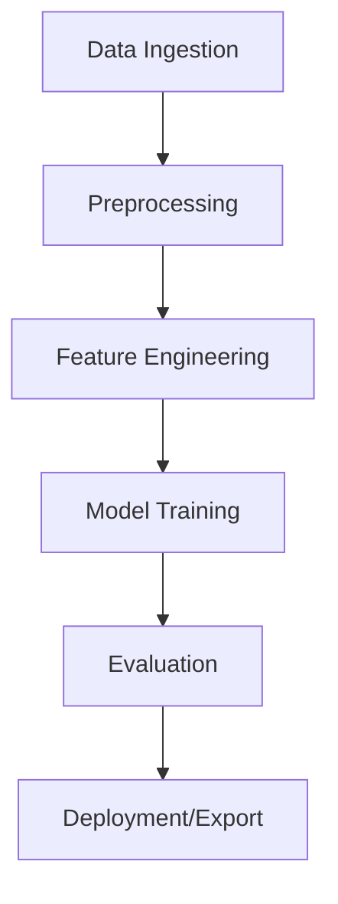

# UPA-F Development Manual (Expanded)

> **Agent Instructions**
> - Always read this document in full when a new session starts.
> - Follow the processes, test requirements, and logging expectations described here before making changes.
> - Keep this document up to date with any code or workflow changes during your session.

---

## Product Overview: Purpose, Audience & Goals

## Codex Session Log (2025-10-05)
- 2025-10-05 21:36: Kickoff session; Bets tab showing zero plays despite predictions for Week 7. Beginning data validation in `upa_predictions`.
- 2025-10-05 21:48: Queried `upa_predictions`; all `value_points_book` magnitudes ≈0.87 because λ=0.6 dampens to `(1-λ)*|edge|`. With value cutoff still at 1.0, no rows qualify, so Bets tab renders empty. Need to retune qualification thresholds to reflect the λ change.
- 2025-10-05 21:58: Rebased qualification thresholds to align with λ=0.6, added env-configurable defaults in `agents/collect/predictions.py`, synced UI constants, and refreshed `qualified_edge_flag` values in the SQLite artifacts.
- 2025-10-05 22:05: Validated dataset after refresh — 181 rows satisfy Bets tab filters (|edge| ≥ 1.5, |value| ≥ 0.6) and 79 rows carry `qualified_edge_flag=1` with the new 0.8 point threshold.
- 2025-10-05 21:54: Predictions tab layout regressed (team names overlap kickoff info, positional grade pills collide). Need to restore structured team header and adjust grade grid spacing.
- 2025-10-05 22:08: Backtest tab empty post-SQLite migration; need one-off builder + manual workflow to hydrate 2024 datasets into `upa_data.sqlite` and deploy.
- 2025-10-12 12:24: Added scripted backtest builder + workflow; latest run populated 2024 tables but missing graded results. Wiring helper grades now and rehydrating to restore W/L counts.
- 2025-10-12 12:30: Cached schedule/markets/team inputs persisted for offline reuse; deploy workflow now runs `tools.build_backtest_data --offline` so model changes automatically refresh backtest results without refetching CFBD.
- 2025-10-12 12:36: Patched live scoreboard ingestion to merge the last ~3 days and retain previous rows when ESPN responds empty, preventing the UI from wiping results on off days.

**What we are trying to do (mission)**
- Build a reliable, transparent, and continuously-updating **college football pricing engine** that:
  - Synthesizes **team fundamentals** (WRPS, Talent, SRS, SOS) with **market lines** (FanDuel preferred) and **live context** (scores).
  - Produces **actionable, auditable predictions** (model vs. market) with quantified **edge** and **confidence**.
  - Publishes results to a **static site** (GitHub Pages) with accompanying **debug artifacts** so issues can be diagnosed quickly.
  - Explicitly generate our own **model spreads** for FBS vs FBS games, grounded in and calibrated against FanDuel’s market spreads, restricted to the **current CFBD week** by default.
- Operate under **deterministic, reproducible** workflows: every CI run **rebuilds all data**, validates freshness, and **fails hard** on emptiness/staleness.

**Who we are doing it for (audience & stakeholders)**
- **Primary users:** UPA maintainers/analysts who need trustworthy edges to guide selections and quickly debug data issues when things look off.
- **Secondary users:** Technical contributors who evolve the model, add features, maintain integrations, and improve deployment/observability.
- **Tertiary consumers:** Potential downstream dashboards/bots that ingest `data/upa_data.sqlite` tables to trigger alerts or produce external views.

**Why this approach**
- Betting markets move; **staleness** and **missing markets** silently destroy value. We explicitly defend against both with **freshness guards**, **backfill**, and **validation gates**.
- Most failures are plumbing, not math. By shipping **debug files** (schedule, market_debug, unmatched, backfill summary) we shorten MTTD/MTTR.
- Static hosting + CI keeps ops simple, secure, and cheap while still giving near-real-time updates on every push.
- We ignore games featuring **non-FBS opponents** to ensure consistency with market availability and to avoid mismatched data coverage.
- We restrict scope to the **current week’s spreads** when fetching and generating predictions, ensuring markets and model comparisons remain fresh and relevant.

---

## Personas & Top Use Cases

**Personas**
- *Analyst*: wants ranked edges with clear confidence; needs to understand **why** an edge exists and whether inputs are trustworthy today.
- *Engineer*: maintains collectors, cache logic, and CI; needs reproducible runs, strong logs, and failing builds when data is bad.
- *Modeler*: experiments with feature weights and algorithms; needs quick iteration and clear checkpoints/artifacts for evaluation.

**Use Cases**
1. **Daily update**: Kick CI; regenerate schedule/markets/predictions; validate; publish.
2. **Slate review**: Sort by `value_points_book`; inspect `qualified_edge_flag`; drill into the `market_unmatched` dataset if coverage drops.
3. **Debug a mismatch**: Compare `market_debug` vs `upa_predictions` join keys; inspect `nan_reason` and `status` JSON.
4. **Model tuning**: Adjust κ, λ, α-weights; re-run; compare MAE/RMSE and realized error on completed games.
5. **Incident response**: Validation fails → halt deploy; use debug artifacts to locate source (schedule stale, market empty, token missing).

---

## Success Criteria & KPIs

**Reliability KPIs**
- **Data freshness**: `cfb_schedule` extends ≥ today+2 (PT); FanDuel lines < 48h old on active slates.
- **Coverage**: ≥ 90% predictions with numeric `market_spread_book` in-season.
- **Build health**: 100% of deploy runs pass validation or fail early; no “green” deploys with empty data.

**Quality KPIs**
- **MAE(model, market)**: monitored weekly; aim for stability with improvements after feature releases.
- **Unmatched rate**: `market_unmatched`/total market rows ≤ 3%; spikes trigger alias review.
- **Synthetic market rate**: ≤ 5% during normal operation (outside emergencies).

**Velocity KPIs**
- CI end-to-end duration: target &lt; 10 minutes with warm caches.
- Time to debug: &lt; 30 minutes to root-cause via `status JSON` + debug CSVs.

---

## Non‑Goals (for clarity)

- Arbitrage execution, portfolio management, staking automation: **out of scope** here.
- Live in-game pricing: **out of scope** (we snapshot pregame markets).
- Non-FBS data products: excluded from this pipeline (keeps mapping clean).

---

## Operating Constraints & Assumptions

- **Environment**: Runs in GitHub Actions on Ubuntu; Python 3.11; Node 20 for UI.
- **APIs/Quotas**: CFBD bearer token required; Odds API keys required for FanDuel; caches limit calls.
- **Idempotency**: Re-running a build with same inputs should reproduce outputs (modulo live-market timestamp changes).
- **Year scoping**: `.cache_cfbd/<year>`, `.cache_odds/<year>` to prevent cross-year bleed.
- **Documentation hygiene**: Any change that touches collectors, workflows, data schemas, or UI consumption **must** update this document in the same change set so the manual stays authoritative.

---

## Data Governance, Secrets & Security

- **Secrets**: Stored in repo secrets (`CFBD_BEARER_TOKEN`, `ODDS_API_KEY`) only; never in code or logs.
- **PII**: None handled; only public sports data; still treat tokens as sensitive.
- **Artifact integrity**: Only `dist/` (site) is published; `data/` is copied into `dist/data/` at build-time.
- **Reproducibility**: All inputs & transforms are materialized to CSV/JSON with exact schemas; changes must be versioned and documented.

---

## Environments & Config

- **Local**: Developers can run `collect_cfbd_all.py` with tokens to reproduce CI outputs into local `data/`.
- **CI (build)**: Always regenerates all artifacts; hard validation blocks deploy on failure.
- **Prod (Pages)**: Static site; data shipped alongside UI as ``dist/data/upa_data.sqlite` plus JSON keys`.

**Configuration surface**
- `MARKET_SOURCE` (default `fanduel`), `YEAR`, κ, λ, α-weights, thresholds (`τ_points`, `τ_conf`), cache TTLs.
- `DATA_DB_PATH` (default `data/upa_data.sqlite`) stores all generated tables; `CACHE_DB_PATH` (default `data/upa_cache.sqlite`) backs collector caches.
- All tunables defined in Python constants or env vars; changes must be reflected in `development.md`.

### Deploy workflow controls (GitHub Actions)
- Manual `workflow_dispatch` runs now expose `enable_cache`, `enable_backtest`, and `backtest_year` inputs.
- Defaults keep both cache restore and backtest disabled (`false`) so push-triggered CI stays deterministic.
- Setting `enable_cache=true` restores the Actions cache and re-enables optional purge; `enable_backtest=true` passes `--backtest <backtest_year>` to the collector.
- Leave inputs untouched to run the live-only pipeline; toggle them explicitly when you need cached data or historical reruns.

### External APIs & Endpoints
- **CollegeFootballData (CFBD)** via the official Python client (`cfbd`):
  - `GamesApi.get_games(...)` for the master schedule.
  - `BettingApi/LlinesApi.get_lines(...)` for CFBD odds fallback.
  - `TeamsApi.get_fbs_teams(...)` and `TeamsApi.get_talent(...)` for team metadata/talent.
  - `PlayersApi.get_returning_production(...)` for Connelly returning production metrics.
  - `RatingsApi.get_srs(...)` and `RatingsApi.get_sos(...)` for SRS/SOS inputs.
- **The Odds API** (`https://api.the-odds-api.com/v4/sports/americanfootball_ncaaf/odds`) for FanDuel market lines (spread market, paginated via `requests.get`).
- **ESPN Scoreboard** (`https://site.api.espn.com/apis/site/v2/sports/football/college-football/scoreboard?dates=YYYYMMDD`) for live scores/clock state.

### Data Collection Workflows
To decouple raw data ingestion from model generation, GitHub Actions now refresh the SQLite datastore independently:
- `refresh-cfbd-weekly` (`.github/workflows/fetch_cfbd_weekly.yml`): runs every Monday 10:00 UTC (and on demand). Calls `python -m agents.jobs.refresh_cfbd_weekly` to update team metadata (FBS teams, returning production, talent, SRS, SOS) and commits `data/upa_data.sqlite` back to `main`.
- `refresh-cfbd-daily` (`.github/workflows/fetch_cfbd_daily.yml`): runs daily at 09:00 UTC. Executes `python -m agents.jobs.refresh_cfbd_daily`, pulling the latest CFBD schedule and CFBD lines fallback into the relational tables.
- `refresh-markets-live` (`.github/workflows/fetch_markets_live.yml`): runs every five minutes on Fridays and Saturdays (manual dispatch available otherwise). Executes `python -m agents.jobs.refresh_markets_live` to fetch FanDuel odds and the ESPN scoreboard via `update_live_scores`, merging the past ~3 days so finals persist. Each run commits the updated SQLite DB with `[skip ci]` to avoid recursive triggers.
- `refresh-cfbd-stats-weekly` (`.github/workflows/fetch_cfbd_stats_weekly.yml`): runs every Tuesday at 12:00 UTC (and on demand). Executes `python -m agents.jobs.refresh_cfbd_stats_weekly` to refresh `raw_cfbd_team_stats` and the normalized feature table used by team inputs, committing the SQLite database when those metrics change.
- `train-spread-model` (`.github/workflows/train_spread_model.yml`): runs every Tuesday at 11:00 UTC (and on demand). Executes `python -m agents.jobs.train_spread_model` to fit the residual ensemble (ridge + boosted stumps), calibrate it, and persist the artifact to `models/residual_model.json`.

The downstream collector (`collect_cfbd_all`) and model builders now read exclusively from `upa_data.sqlite`, so the deploy workflow can focus on transformation, validation, and publishing without re-hitting upstream APIs.

---

## Release, Deploy & Change Management

- **Release cadence**: As‑needed; each push to `main` is a potential deploy.
- **Validation gate**: Build fails if schedule stale, predictions empty, or market debug empty.
- **Observability**: Status page shows counts, MAE, coverage, synthetic rate, and links to debug artifacts.
- **Rollbacks**: Revert commit; CI redeploys with restored data generation.
- **Market persistence**: Deploy workflow appends new market pulls to the committed `data/market_debug` before writing, then feeds the combined history into predictions so previously played games retain bookmaker spreads.

---

## Ops Runbook (MTTD/MTTR)

1. **UI shows zeros / 404s**  
   - Check GitHub Action logs for **validation failure**; open `status JSON`, `market_debug.json`.
   - Verify `data/` contents in artifact; ensure files exist in `dist/data/`.
2. **Schedule stuck at old date**  
   - Freshness guard should refetch; if not, confirm `CFBD_BEARER_TOKEN` present; inspect `.cache_cfbd/<year>`.
3. **Markets missing**  
   - Confirm `ODDS_API_KEY`; check `market_unmatched`; review team alias normalizer.
4. **Predictions empty**  
   - Ensure predictions builder is present; verify joins; check `nan_reason` distribution.
5. **Frequent cache misses or API throttling**  
   - Audit cache keys; raise TTLs conservatively; reduce redundant calls.

---

## Current Issues & Focus Areas *(updated 2025-09-21)*

- **Week 5 market coverage**: FanDuel returns limited spreads early in the week. We now merge new pulls with existing `market_debug`; monitor `market_predictions_backfill.json` to ensure previously played games retain bookmaker lines and synthetic rate stays ≤ 5%.
- **Manual workflow toggles**: Caching and backtest are disabled by default. When re-enabled for investigations, confirm toggle values in the workflow run summary and reset them to `false` afterwards.
- **Backtest builder workflow**: Use `build-backtest` (workflow_dispatch) when you need to refresh historical seasons. It runs `python -m tools.build_backtest_data --year <season>`, copies the updated SQLite into `dist/data/`, commits with `[skip ci]`, and redeploys Pages. Provide `CFBD_BEARER_TOKEN` before triggering; this job only runs on demand. An initial online run is required to seed the cached `backtest_*` tables so future deploys can recompute offline.
- **Schedule freshness**: Early-week runs can lag if CFBD throttles. Keep an eye on the validation check (`schedule stale`) and bump `FORCE_REFRESH_*` envs for a one-off retry if needed.

---

## Roadmap (High Confidence Next Steps)

  - Add a **Historical Predictions Archive**: after each run, persist a snapshot of that week's predictions to a year/week-scoped path (see "Historical Predictions Archive" below) so we can analyze model drift and realized error over time.
  - Ensure collectors only ingest **current week market spreads** (default), with overrides available for testing/backfill. Document and enforce week scoping consistently.
  - Ensure all collectors and predictions builders filter out **non-FBS matchups**; predictions and edges should only be computed for FBS vs FBS games.
  - Implement real **portal_net_0_100** from transfer portal data.
  - Finalize in-repo **build_predictions_for_year** with confidence model.
  - Add **build_live_edge_report** and formalize edge/value distribution checks.
  - Expand **validation** to require minimum **coverage** on slate days.
  - Add **alerting** on validation failures (GitHub Issue/Slack webhook).
  - **In flight – Statistical feature library**
    - ✅ `agents.collect.stats_cfbd.build_team_stat_features` fetches CFBD season stats (offense/defense/special teams), normalizes them to 0–100, and persists both raw + feature tables.
    - ✅ `build_team_inputs_datadriven` now merges efficiency features (`stat_off_ppg`, `stat_def_ppg`, etc.) for downstream modeling.
    - ☐ Add situational splits (3rd/4th down, red zone) and rolling four-week deltas.
    - ☐ Expand tests covering payload parsing and normalization edge cases.
  - **In flight – Positional ranking model**
    - ✅ Derived unit grades (QB/RB/WR/OL/DL/LB/DB/ST) from CFBD efficiency composites; letters now reflect percentile tiers across FBS (A+ top ~1%, D-/F bottom decile).
    - ☐ Design richer positional metric schema leveraging roster/usage inputs (injuries, depth charts).
    - ☐ Produce `raw_positional_ratings` dataset with per-unit scores and integrate into team inputs/predictions.
  - **Next phase – Data-driven spread model**
    - ✅ Export historical training dataset (team stat snapshots + market outcomes) via `agents.collect.model_dataset`.
    - ✅ Train the residual spread ensemble (`agents.collect.spread_model` + `agents.jobs.train_spread_model`) using new stats/grades; model blob persisted to `models/residual_model.json` with calibration metadata.
    - ✅ Integrate model predictions into `build_predictions_for_year` as an additive adjustment over the market spread.
    - ☐ Calibrate residuals and monitor MAE/coverage vs. market baseline, add alerting when residual drift > threshold.
  - **In flight – Historical baselines & drift monitoring**
    - ☐ Snapshot pre-kick predictions weekly (using frozen spreads) into a longitudinal table for MAE/cover tracking.
    - ☐ Expose rolling baseline metrics and alerts on the Status tab.
  - Integrate **advanced statistical databases** (CFB Stats, PFF-style sources if available) into feature ingestion.
  - Build automated **feature importance reports** to surface which stats are driving edge.
  - Enhance **explainability layer** in the UI: when showing an edge, highlight which statistical categories most contributed.

### Data Availability via CFBD

Many of the statistical features and positional metrics planned in the roadmap can be sourced or proxied via the **CollegeFootballData (CFBD) API**. Below is a mapping of roadmap items → CFBD endpoints:

- **Offensive efficiency metrics**  
  - CFBD endpoint: `/stats/season` (with `team`, `category=offense`)  
  - Provides: yards/play, points/play, success rate, EPA/play (if available).

- **Defensive efficiency metrics**  
  - CFBD endpoint: `/stats/season` (with `team`, `category=defense`)  
  - Provides: opponent yards/play, points allowed/play, defensive success rate.

- **Tempo & pace indicators**  
  - CFBD endpoint: `/stats/season` (category=offense) includes plays per game, seconds/play.

- **Explosiveness & chunk plays**  
  - CFBD endpoint: `/stats/season` with advanced metrics flags.

- **Red-zone efficiency**  
  - CFBD endpoint: `/stats/season` (scoring opportunities vs conversions).

- **3rd/4th down conversion rates**  
  - CFBD endpoint: `/stats/season` or `/teams/matchup` with situational filters.

- **Special teams impact**  
  - CFBD endpoint: `/stats/season` (category=specialTeams) includes field position value, kicking efficiency.

- **Position vs position matchups & positional rankings**  
  - CFBD does not directly expose OL vs DL or WR vs CB.  
  - Partial data can be approximated via `/teams/roster` (player positions, experience) and `/stats/season` (sack rate, pass protection metrics).  
  - Full position grades likely require external data (e.g., PFF, custom scraping).

- **Transfer portal / roster changes**  
  - CFBD endpoint: `/player/portal` and `/teams/roster`.  
  - Provides portal entries, incoming/outgoing players, positions.

- **Historical baselines**  
  - CFBD endpoint: `/stats/season` with `year` parameter.  
  - Enables building rolling averages or multi-year trends.

**Note**:  
- CFBD’s `/stats/season` endpoint is the workhorse for most team-level efficiency metrics.  
- Some advanced stats (EPA/play, explosiveness, havoc rate) may only be partially covered or require derived calculations from play-by-play endpoints (`/plays`).  
- Positional matchups will need augmentation from external databases; CFBD provides roster and play-level context but not graded position-vs-position ratings.

### How Statistical Features Influence the Model’s Predicted Spread

The purpose of this model is to **calculate our own expected spread** for each FBS matchup, grounded in FanDuel’s lines but adjusted by team statistical profiles.

Incorporating the expanded statistical library is not just about adding raw numbers—it is about **shaping the predicted spread (model_spread_book)** in ways that reflect both fundamental strengths and matchup-specific edges.

**Key Integration Principles**
- **Feature weighting**: Stats should not be 1-to-1 inputs; they must be normalized, weighted, and blended into composite scores (offense, defense, tempo, etc.).
- **Contextual adjustment**: Some features matter more in certain matchups (e.g., OL vs DL strength when predicting rushing success).
- **Stability vs signal**: Use rolling averages or multi-week samples to smooth volatility while preserving recent trends.

**Examples of Influence**
- **Offensive efficiency (yards/play, EPA/play)** → raises the baseline power score for the team’s offense, making spreads more favorable toward them.
- **Defensive efficiency (points allowed/play, havoc rate)** → reduces opponent expected scoring, making spreads more favorable to defense-strong teams.
- **Tempo/pace** → high tempo inflates variance; the model can adjust expected margin distribution (wider spreads and higher uncertainty).
- **Explosiveness** → increases weight of potential blowouts; model may lean toward larger spreads if one side generates more chunk plays.
- **Red-zone efficiency** → adjusts conversion of drives to points; poor red-zone efficiency tempers expected scoring despite strong yardage stats.
- **3rd/4th down conversions** → influences sustained drives; strong conversion rates support model favoring that team in close spreads.
- **Special teams** → affects hidden yardage; good ST shifts expected field position, improving team’s modeled efficiency.
- **Position vs position matchups** → specific unit ratings (e.g., WR vs CB) adjust spread incrementally depending on mismatch severity.
- **Transfer portal and roster changes** → significant player losses or gains shift baseline power ratings up or down, especially if affecting QB, OL, or secondary depth.

**Mathematical Form (conceptual)**
- Let $S_{off}$ = offensive composite (efficiency + explosiveness + tempo adj).
- Let $S_{def}$ = defensive composite (efficiency + havoc + red-zone stops).
- Let $S_{st}$ = special teams composite.
- Let $S_{pos}$ = positional matchup adjustments (sum of unit mismatch deltas).
- Then **team strength score**:
  $$
  S_{team} = \alpha_{off} S_{off} + \alpha_{def} S_{def} + \alpha_{st} S_{st} + S_{pos}
  $$
- Spread prediction:
  $$
  M_{model} = -(\kappa (S_{home} - S_{away}) + HFA)
  $$
  where $HFA$ = home field adjustment.

**Guidance**
- Weights ($\alpha$) should be learned or tuned empirically.
- Early season: shrink toward priors (talent, returning production).
- Late season: rely more on in-season stats (efficiency, matchups).
- Always run feature importance analysis to confirm which stats drive edge.

This ensures the model’s spreads are not just generic power ratings but **context-aware predictions** grounded in the statistical profile of each team and matchup.

---

## Risks & Mitigations

- **Upstream API instability** → Cache with sane TTLs, retry with backoff, and clear fallbacks; surface via `status JSON`.
- **Name/alias drift** → Centralize canonicalization; unit tests for alias tables; monitor `market_unmatched`.
- **Sign convention mistakes** → Enforce conversions at ingress; unit tests for edge/expected calculations.
- **Silent partial data** → Hard validation in CI; visible coverage metrics on Status page; never deploy empty headers only (except explicit placeholders).

## Repository Structure


### Key Directories
- `src/`: Source code for all pipeline components.
- `data/raw/`: Unmodified input data.
- `data/processed/`: Cleaned/feature-engineered data.
- `artifacts/`: Model checkpoints and evaluation reports.
- `logs/`: All logs (info, debug, errors).
- `tests/`: Unit and integration tests.
- `.github/workflows/`: CI/CD definitions.

---

## Pipeline Overview

The UPA-F pipeline is a modular, reproducible data science workflow:

1. **Data Ingestion**: Fetches and validates raw data from local files, databases, or remote APIs.
2. **Preprocessing**: Cleans, transforms, and normalizes data, handling missing values and outliers.
3. **Feature Engineering**: Constructs new features, temporal statistics, and encodings.
4. **Model Training**: Fits a predictive model (default: XGBoost) using training data.
5. **Evaluation**: Produces metrics, error analysis, and visualizations.
6. **Deployment/Export**: Saves model and predictions for downstream use.

---

## Data Artifacts

| Artifact                | Location             | Description                               |
|-------------------------|---------------------|-------------------------------------------|
| Raw Data                | `data/raw/`         | Original, unmodified input data           |
| Processed Data          | `data/processed/`   | Cleaned and feature-engineered data       |
| Model Checkpoints       | `artifacts/models/` | Trained model weights and configs         |
| Evaluation Reports      | `artifacts/reports/`| Metrics, plots, and error analysis        |
| Logs                    | `logs/`             | Execution, debug, and error logs          |

## Caching Strategy & Retention Policy

This section documents **what we cache**, **where it lives**, **how long it lives (TTL)**, **how to invalidate it**, and **how CI keys interact with on-disk caches**. It also includes do/don’t guidance to avoid accidentally nuking backtest caches.

### 1) Cache Layers (overview)

We use **two distinct cache layers**:

1. **Local/Workspace caches (filesystem):**
   - CFBD: `.cache_cfbd/<year>/...` (JSON blobs keyed by request, e.g., schedule/games endpoints)
   - Odds/FanDuel: `.cache_odds/<year>/...` (JSON/CSV snapshots keyed by event/date/book)
   - Purpose: *Reduce upstream API calls within a run and across runs on the same runner.*
   - Lives in the repo workspace during CI (ephemeral VM) and also works for local developers.

2. **GitHub Actions cache (artifact cache):**
   - Restored via `actions/cache@v4`, paths:
     - `.cache_cfbd/2025`
     - `.cache_odds/2025`
   - Keyed with a **composite key** that includes:
     - OS + `MARKET_SOURCE` + season + a **version suffix** (we bump to bust),
     - Hash of critical collector code (e.g., `hashFiles('agents/collect_cfbd_all.py')`).
   - Purpose: *Warm-start subsequent CI runs with the latest good local/workspace caches.*

> **Important:** These layers are additive. Filesystem caches are the raw objects; the Actions cache simply persists those directories across workflows keyed by our strategy.

---

### 2) Default TTLs & Freshness Rules

- **CFBD (`.cache_cfbd/<year>`)**
  - **Soft TTL:** ~90 days for static endpoints (teams, SRS, historical season endpoints).
- **Freshness gate for schedule:** we **ignore** schedule caches if `max(date) < (today_Pacific + 2 days)` or if total rows `< 200`.
    - This is not a time-based TTL; it’s a **content freshness** rule that **forces a refetch** if the schedule is too short or ends too early.
  - **Reset events:** season rollover (August), schema changes to schedule loader, or widespread API corrections.

- **Odds/FanDuel (`.cache_odds/<year>`)**
  - **TTL:** 2 days (configurable via `ODDS_CACHE_TTL_DAYS`, default 2).
  - We prefer **fresh lines** (< 48 hours) on active slates; CI validation requires that `market_debug` is **non-empty**; if empty due to staleness, the build fails.
  - **Reset events:** book availability changes, mapping logic updates, or alias table revisions.

> **Backtest note:** Backtest caches can be retained far longer since historical endpoints are immutable; favor **year-scoped dirs** to isolate them from live-season caches.

---

### 3) When To Reset (Playbook)

Reset caches when any of the following happens:

- **Stale schedule symptoms**: UI shows “stuck” week; last predictions date is 10–15 days old; CI warns schedule stale → **reset CFBD cache**.
- **FanDuel mismatch**: `market_debug` empty while lines are clearly live; `market_unmatched` spikes → **reset Odds cache**.
- **Alias/table updates**: You change canonicalization/regex rules → reset **both** Odds + any derived joins.
- **Schema changes**: You add/remove columns in loaders → bump Actions cache **version suffix**.
- **Season rollover**: Start of a new season (July/August) → create **new year directories** and **new Actions cache keys**.
- **Bug in cache writes**: Corrupt JSON/CSV discovered → delete the affected keys/directories and re-run.

---

### 4) How To Reset (Safely)

**A. Local/Workspace (filesystem)**
- Remove the directory for the affected year:
  ```bash
  rm -rf .cache_cfbd/2025
  rm -rf .cache_odds/2025
  ```
- Re-run the collectors; they will re-populate from upstream APIs.

**B. GitHub Actions cache (artifact cache)**
- **Bump the cache key version** in the workflow so a fresh cache is created and used:
  ```yaml
  with:
    key: api-caches-${{ runner.os }}-${{ env.MARKET_SOURCE }}-season-2025-**v4**-${{ hashFiles('agents/collect_cfbd_all.py') }}
    restore-keys: |
      api-caches-${{ runner.os }}-${{ env.MARKET_SOURCE }}-season-2025-
      api-caches-${{ runner.os }}-${{ env.MARKET_SOURCE }}-
      api-caches-${{ runner.os }}-
  ```
- Alternatively, **invalidate by code-change**: modifying `agents/collect_cfbd_all.py` changes the hashed portion of the key.

**C. CI-only force refresh knobs**
- Add env flags to bypass caches for a run:
  - `FORCE_REFRESH_SCHEDULE=1` → always refetch schedule endpoints.
  - `FORCE_REFRESH_MARKETS=1` → bypass odds cache and hit book endpoints.
- Wrap loaders with: “if env flag present → ignore cache layer”.

---

### 5) Don’t Nuke Backtests Accidentally

- **Keep year-scoped directories**: `.cache_cfbd/2024` vs `.cache_cfbd/2025`.
- **Never** run `rm -rf .cache_cfbd` at the repo root during live-season unless you intend to rebuild *all* years.
- In CI, **do not** change the restore key prefix for backtest years unless the collectors changed in a way that invalidates history.
- If you must refresh backtest cache, target the year explicitly and run during off-hours to avoid rate limits.

---

### 6) Cache Key Design (Actions)

Our cache key is crafted to balance reuse and control:

- Prefix: `api-caches-${{ runner.os }}-${{ env.MARKET_SOURCE }}-season-2025-`
- **Version suffix**: manual bump (`v1`, `v2`, …) to force full invalidation on breaking changes.
- **Hash payload**: `hashFiles('agents/collect_cfbd_all.py')` so logic changes trigger a different cache.
- Restore key ladder allows fallback to **older** caches if the exact key is missing, which still reduces cold-starts.

**Example**
```yaml
key: api-caches-${{ runner.os }}-${{ env.MARKET_SOURCE }}-season-2025-v4-${{ hashFiles('agents/collect_cfbd_all.py') }}
restore-keys: |
  api-caches-${{ runner.os }}-${{ env.MARKET_SOURCE }}-season-2025-
  api-caches-${{ runner.os }}-${{ env.MARKET_SOURCE }}-
  api-caches-${{ runner.os }}-
```

---

### 7) Monitoring & Observability

- **Status page** surfaces:
  - `generated_at_utc`, counts of schedule/predictions rows.
  - Synthetic rate and market coverage (proxy for cache/mapping health).
- **CI logs** print:
  - “MARKET_SOURCE (requested): …”
  - Cache directories used (env `CACHE_DIR`, `ODDS_CACHE_DIR`).
  - Snippets of `status JSON` and presence/rows of `market_debug.json/csv`.
- **Alarms** (future): on validation failure, open a GitHub Issue or ping a webhook.

---

### 8) FAQ

- **Q:** *How long do caches live if I never bump keys?*  
  **A:** Filesystem caches live as long as the workspace; Actions caches live until GitHub evicts them (LRU) or you change the key. We treat CFBD as ~90-day “soft TTL” and Odds as 2 days via loader logic.

- **Q:** *When should I clear caches if FanDuel week alignment looks wrong?*  
  **A:** First check schedule freshness; then purge `.cache_odds/<year>` (local + Actions) and re-run with `FORCE_REFRESH_MARKETS=1`.

- **Q:** *Can I exclude backtest caches from resets?*  
  **A:** Yes—use separate year directories and **never** share keys across years. Only bump the **current season** key.

- **Q:** *What if I see API rate-limits after a purge?*  
  **A:** Stagger runs, increase TTLs temporarily, or reduce breadth of endpoints per run. Consider running in two jobs: schedule first, then markets.

---

### Historical Predictions Archive

We keep immutable snapshots of **past weeks' predictions** for retrospective analysis, drift tracking, and realized error studies.

**Archive Pathing**
- Root: `archive/predictions/`
- Structure: `archive/predictions/{year}/week_{week}/upa_predictions`
- Optional extras per week (if present):
  - `market_debug` (book lines snapshot)
  - `cfb_schedule` (week slice)
  - `status JSON` (run metadata)

**When archived**
- If the same `{year, week}` already exists, we **do not overwrite** by default; instead, write a timestamped subfolder: `week_{week}/run_{YYYYMMDD_HHMMSSZ}/...` (configurable via `ARCHIVE_OVERWRITE=1`).

**Intended Use**
- Power long-term metrics (MAE drift, coverage, synthetic rate) across weeks.
- Enable post-mortems comparing model vs market vs final scores.
- Provide a stable dataset for backtests without re-hitting external APIs.

**Suggested CI step (pseudocode)**
```bash
YEAR=${YEAR:-2025}
# Determine WEEK (auto-detected earlier in the pipeline) and pass into env

    mkdir -p dist/data
    cp data/upa_data.sqlite dist/data/ || true
    cp -R public/* dist/ || true
    ```
  - If a dataset is empty, the UI surfaces an empty state; we write structural placeholders where necessary to keep links valid.

### Summary Table

| Table / JSON key (legacy path)            | Where Generated                         | Who Generates It                                           | UI Consumers / Links                                                | CI Validation |
|-------------------------------------------|-----------------------------------------|-----------------------------------------------------------|----------------------------------------------------------------------|--------------|
| `raw_cfbd_games`                          | Collector schedule fetch                | `load_schedule_for_year` (CFBD games API)                  | Source-of-truth for schedule reconciliation, cross-source joins      | —            |
| `raw_fanduel_lines`                       | Collector odds fetch                    | `get_market_lines_for_current_week` (FanDuel/Odds API)     | Market reconciliation, debugging                                     | —            |
| `raw_cfbd_lines`                          | Collector odds fallback                 | `get_market_lines_for_current_week` (CFBD lines API)       | Market reconciliation, debugging                                     | —            |
| `raw_cfbd_fbs_teams`                      | Team metadata fetch                     | `build_team_inputs_datadriven` (CFBD teams API)            | Team dimension/alias mapping                                        | —            |
| `raw_cfbd_returning_production`           | Team inputs fetch                       | `build_team_inputs_datadriven` (CFBD players API)          | Team inputs, feature engineering                                     | —            |
| `raw_cfbd_talent`                         | Team inputs fetch                       | `build_team_inputs_datadriven` (CFBD teams API)            | Team inputs, feature engineering                                     | —            |
| `raw_cfbd_srs`                            | Team inputs fetch                       | `build_team_inputs_datadriven` (CFBD ratings API)          | Team inputs, feature engineering                                     | —            |
| `raw_cfbd_sos`                            | Team inputs fetch                       | `build_team_inputs_datadriven` (CFBD ratings API)          | Team inputs, feature engineering                                     | —            |
| `raw_espn_scoreboard`                     | Live scoreboard fetch                   | `collect_cfbd_all` (ESPN scoreboard)                       | Live monitoring, status                                              | —            |
| `cfb_schedule`                             | Collector + ALL step                    | `load_schedule_for_year` → `write_dataset`                 | Status, week logic; optional fallback spreads                       | ✅ stale/size |
| `upa_team_inputs_datadriven_v0`           | Collector + ALL step                    | `build_team_inputs_datadriven` → `write_dataset`           | Status counts (optional)                                            | —            |
| `market_debug`                             | Collector + ALL step                    | `get_market_lines_for_current_week` → `write_dataset`      | Status (Market Debug), backfill source                              | ✅ non-empty |
| `market_debug` (JSON summary)             | Collector                               | `_upsert_status_market_source` / `market_debug_entry`      | Status diagnostics                                                   | —            |
| `market_unmatched`                        | During market normalization             | Name matcher emits unresolved rows                          | Status link; analysts fix aliases                                    | — (placeholder ok) |
| `upa_predictions`                         | Collector + ALL step                    | `build_predictions_for_year` → `write_dataset` + backfill  | **Predictions tab**, bets/live tabs                                  | ✅ non-empty |
| `upa_predictions_2024_backtest`           | Backtest workflow                        | `build_backtest_dataset` → `write_dataset`                 | **Backtest tab** historical rows                                     | ✅ non-empty |
| `backtest_schedule_2024`                  | Backtest workflow                        | `build_backtest_dataset` (online hydration)                | Offline backtest reruns (schedule cache)                              | ✅ non-empty |
| `backtest_markets_2024`                   | Backtest workflow                        | `build_backtest_dataset` (online hydration)                | Offline backtest reruns (market cache)                                | ✅ non-empty |
| `backtest_team_inputs_2024`               | Backtest workflow                        | `build_backtest_dataset` (online hydration)                | Offline backtest reruns (team features cache)                         | ✅ non-empty |
| `live_edge_report`                        | ALL step                                | `build_live_edge_report` → `write_dataset`                  | Optional live edge table                                             | — (placeholder ok) |
| `backtest_summary_2024`                   | Backtest workflow                        | `build_backtest_dataset` → `_compute_backtest_summary`     | **Backtest tab** weekly hit-rate summary                             | ✅ non-empty |
| `live_scores`                              | ALL step / live refresh                  | `update_live_scores` (merges ~3 days of ESPN scoreboard)   | Status checks; Live Results tab, populates home/away finals          | ✅ readable  |
| `status` (JSON)                            | Collector + ALL step                    | Status composer                                            | **Status tab** counts/metadata                                       | —            |
| `market_predictions_backfill` (JSON)      | ALL step / diagnostics                  | Coverage summary                                           | Status link (Backfill Summary)                                       | —            |
| `upa_data.sqlite` (copied to `dist/data/`) | After ALL step + copy to `dist/data/`   | Shell `cp data/upa_data.sqlite dist/data/`                  | **All UI SQL queries (via sql.js)**                                  | —            |


**Key Guarantee:** Every CI run **regenerates** these artifacts. If a critical file is empty/stale, the **validation step fails** the build, preventing accidental deployment.

## Market Sources: FanDuel vs CFBD / Legacy `market_spread`

This section explains **how we use FanDuel vs other market sources**, how the data flows into predictions, and what the **priority & fallback** rules are.

### Source Priority (ingestion → predictions)
1. **FanDuel (Odds API)** — primary source for bookmaker lines.
   - Controlled by `MARKET_SOURCE=fanduel`.
   - Cached under `.cache_odds/<year>` (TTL ~2 days).
   - Written to `data/market_debug` and `data/market_debug.json`.
   - After fetching, we merge in CFBD spreads for any games missing a FanDuel line so finished games retain a market value the rest of the week.
    - FanDuel fetch now requests data through **current week + 1**, so upcoming games in the next week are captured alongside the current slate.
    - Debug logs: look for `get_market_lines_for_current_week` and `_fetch_cfbd_lines` messages to verify FanDuel coverage and CFBD fallback counts.
2. **CFBD odds** — fallback when FanDuel is unavailable or token/limits block retrieval.
   - Same normalization/sign convention as FanDuel (bookmaker sign: negative = home favored).
   - Written into `market_debug.*` with metadata noting `source=cfbd`.
3. **Legacy schedule column `market_spread`** — last-resort backfill if neither FanDuel nor CFBD provided a line for a game.
   - Copied into `market_spread_book` **only when** `market_spread_book` is NaN and `market_spread` is numeric.
   - Rows populated this way are marked `market_is_synthetic=true`.

### Join Keys & Alignment
We try, in order:
- `(game_id, week)` exact
- `(home_team_norm, away_team_norm, week)` exact
- Fuzzy: `(home_team_norm, date)` within ±1 day and fuzzy title ≥ θ (default 0.92)

**Week alignment**: we align FanDuel slates to **CFBD week numbers**. If FanDuel posts events with off-cycle “week” labeling, we trust schedule week from `cfb_schedule` and match on date ±1 day.

### Sign Convention & Coercion
- All book lines are normalized to **bookmaker sign** for the **home** team (negative favors home).
- `market_spread_book` and `model_spread_book` must share the same sign before computing `edge_points_book`.
- Coercion step converts strings like `"PK"`, `"+0"`, `"-0.5"` to numeric; invalid entries become **NaN** (not `0`).

### Confidence & Synthetic Flag
- `market_is_synthetic=false` for lines sourced from FanDuel/CFBD joins.
- `market_is_synthetic = 1` whenever we had to fall back to a non-book value (legacy schedule, model fill, etc.).
- `model_confidence` comes from the residual ensemble and decays when:
  - the predicted residual magnitude is large relative to `model_residual_sigma`,
  - the line is synthetic or sourced outside FanDuel/CFBD (extra 50–30% haircut),
  - join matched on fuzzy criteria rather than exact keys.
- Final `market_adjustment` = `residual_pred_calibrated × source_scale × model_confidence`, clipped to ±8 points. Source scales: FanDuel=1.0, CFBD=0.35, Model=0.0, Unknown=0.5.

### Backfill Hierarchy inside Predictions
When building the `upa_predictions` dataset, the backfill logic enforces this per-row merge order:
1) Preserve any existing numeric `market_spread_book` (never overwrite sourced book lines).
2) For rows still NaN, copy from legacy `market_spread` if present and flag `market_is_synthetic`.
3) Still NaN → join against `market_debug` (FanDuel) first on `(game_id, week)`, then `(home_team, away_team, week)`.
4) Still NaN → join `cfb_schedule` if it carries a `market_spread_book` column (rare CFBD fallback).
5) Rows that remain NaN after all joins get `market_spread_book = model_spread_book` and `market_is_synthetic = 1` so the UI stays populated but clearly marked synthetic.
After backfill:
- `expected_market_spread_book = 0.6 * market + 0.4 * model` (dampened expectation).
- `edge_points_book = model - market` (positive = model likes away).
- `value_points_book = market - expected` (how far the book is from the dampened expectation).

### What the UI Shows (FanDuel vs “Market”)
- **Predictions tab**:
  - `Market` column = `market_spread_book` (bookmaker sign).
  - `Expected` column = `expected_market_spread_book` (λ-blend of market & model).
  - `Edge` and `Value` computed from the above.
- **Status tab**:
  - Shows which source was used (`fanduel` or `cfbd`) and the **synthetic rate** for transparency.
  - Links to `market_debug` for inspection and `market_unmatched` for mapping issues.

### Validation Rules Related to Markets
- CI **fails** if `data/market_debug` is empty (non-slate days excepted only if we explicitly allow).
- Predictions must have **> 0 rows**; if the builder is missing or the joins produce 0, the build fails.
- Schedule must not be stale; otherwise FanDuel joins may appear “empty” due to date drift.

### Troubleshooting FanDuel vs CFBD Discrepancies
1. Query the `market_debug` dataset in the deployed site (or from the workflow artifact).
2. Verify sign and team names (canonical forms).
3. Check `market_unmatched` for join failures or non-FBS leakage.
4. Confirm week/date alignment (FanDuel listings vs CFBD schedule week; date ±1 day).
5. Inspect CI logs for “Market Source” lines and cache paths (`.cache_odds/<year>`).
6. If CFBD is in use unexpectedly:
   - verify `ODDS_API_KEY` presence/limits,
   - check HTTP errors in logs,
   - ensure `MARKET_SOURCE=fanduel` in env.

### Example
- FanDuel posts `Home -3.5`. After normalization:
  - `market_spread_book = -3.5` (home favored).
  - Suppose model says `M_model = -5.0` → `edge_points_book = -5.0 - (-3.5) = -1.5` (model more bullish on home by 1.5).

---

## CI/CD Workflow

**Workflow Definition**: `.github/workflows/ci.yml`

### Steps:
1. **Dependency Installation**
   - Uses `requirements.txt`.
2. **Unit/Integration Tests**
   - Runs all tests in `tests/` via `pytest`.
3. **Linting**
   - Enforces style with `flake8`; fails on violations.
4. **Build & Artifact Generation**
   - Runs the full pipeline if needed.
   - Uploads model and reports as workflow artifacts.
5. **(Optional) Documentation Build**
   - Generates docs if configured.

### CI/CD Features:
- **Cache Scoping**: Caches are keyed by Python version and `requirements.txt` hash for speed and reproducibility.
- **Stale Schedule Guards**: Pipelines abort if data is outdated or incomplete, preventing propagation of stale results.
- **Fallback Logic**: If a data source fails, the pipeline can revert to the last known good artifact (see Error Handling).

---

## UPA-F Algorithm Logic

### High-Level Description
UPA-F (Unified Predictive Algorithm - Forecasting) is a modular, time-aware prediction pipeline optimized for reliability and reproducibility.

### Mathematical Formulation
- Let $X \in \mathbb{R}^{n \times d}$ be the feature matrix, $y \in \mathbb{R}^n$ the target.
- Model: $f_\theta: X \to y$, where $\theta$ are model parameters.
- Loss: $L(y, \hat{y}) = \frac{1}{n} \sum_{i=1}^n (y_i - \hat{y}_i)^2$ (RMSE) or $|y_i - \hat{y}_i|$ (MAE).
- Feature engineering: $X' = \phi(X)$, where $\phi$ includes rolling means, one-hot encodings, etc.

### Detailed Pseudocode
```python
# Input: config (dict), containing all pipeline parameters
def run_pipeline(config):
    # Data Ingestion
    X_raw = ingest_data(config["data_source"])
    log("Raw data shape: {}".format(X_raw.shape))

    # Preprocessing
    X_clean = preprocess(X_raw, **config["preprocessing"])
    log("Preprocessed data shape: {}".format(X_clean.shape))

    # Feature Engineering
    X_feat, y = feature_engineering(X_clean, **config["features"])
    log("Feature matrix shape: {}".format(X_feat.shape))

    # Train/Test Split (time-based split if temporal)
    X_train, X_test, y_train, y_test = split_data(X_feat, y, **config["split"])

    # Model Training
    model = Model(**config["model_params"])
    model.fit(X_train, y_train)
    log("Model trained.")

    # Evaluation
    y_pred = model.predict(X_test)
    metrics = evaluate(y_test, y_pred, **config["evaluation"])
    log("Evaluation metrics: {}".format(metrics))

    # Export
    model.save(config["output_path"])
    save_report(metrics, config["report_path"])
```

### Core Parameters
| Parameter         | Description                              | Example                   |
|-------------------|------------------------------------------|---------------------------|
| data_source       | Path/URI to input data                   | `data/raw/input_dataset`      |
| preprocessing     | Dict of preprocessing ops                | `{normalize: True}`       |
| features          | Feature engineering steps                | `['rolling_mean', ...]`   |
| model_params      | Model hyperparameters                    | `{max_depth: 6, ...}`     |
| split             | Train/test split params                  | `{method: 'time', ...}`   |
| evaluation        | Metrics to compute                       | `{metrics: ['mae', 'rmse']}` |
| output_path       | Where to save model                      | `artifacts/models/upa-f`  |
| report_path       | Where to save evaluation report          | `artifacts/reports/`      |

### Algorithmic Details
- **Data Ingestion**: Supports CSV, Parquet, SQL, and REST API sources. Validates schema and checks for missing columns.
- **Preprocessing**:
  - Missing value imputation: mean, median, or forward fill.
  - Outlier handling: capping or removal.
  - Normalization: MinMaxScaler or StandardScaler.
- **Feature Engineering**:
  - Rolling statistics: $x'_t = \frac{1}{w} \sum_{i=t-w+1}^t x_i$ (window $w$).
  - Time-based features: day-of-week, hour, holiday flags.
  - One-hot encoding for categorical variables.
- **Model**: Default is XGBoost; plug-and-play for scikit-learn, LightGBM, etc.
- **Evaluation**:
  - Metrics: MAE, RMSE, custom scoring.
  - Plots: Residuals, feature importances.

### Symbol Table
- $X$ = feature matrix
- $y$ = target vector
- $f_\theta$ = model function with parameters $\theta$
- $L$ = loss function
- $w$ = window size for rolling features


## Metrics & Definitions (Deep Dive)

This section defines every metric/column that appears in the CSVs and UI, explains **why it exists**, and shows **how it is used** downstream (edge qualification, sort order, validation).

### A. Spread & Model Metrics (per game)

| Column / Term                       | Type      | Definition (home-centric sign)                                                                                                                                                                     | Purpose / Usage                                                                                                  |
|------------------------------------|-----------|------------------------------------------------------------------------------------------------------------------------------------------------------------------------------------------------------|-------------------------------------------------------------------------------------------------------------------|
| `model_spread_book`                | float     | Anchored model spread for the **home** team in bookmaker sign. When a market line exists: `M_model = M_market + market_adjustment`. Without a market line the column falls back to `model_spread_baseline`. | Core model output for comparisons and value. Drives `expected`, `edge`, and `value`.                              |
| `model_spread_baseline`            | float     | Rating-differential baseline prior to residual anchoring: `baseline = -(κ*(S_home - S_away) + HFA)` with the standard feature blend and home-field term.                                        | Diagnostic handle for how far the residual moved us away from the raw rating model.                              |
| `market_spread_book`               | float     | Latest normalized market line (FanDuel preferred; CFBD fallback) for the **home** side, using the same sign convention as above.                                                                     | The ground truth comparator for pricing disagreement.                                                             |
| `market_spread_fanduel`            | float     | Raw FanDuel spread (home-centric sign) when available for the matchup.                                                                                                                              | Auditing aid; confirms the exact FanDuel price that fed `market_spread_book`.                                     |
| `market_spread_cfbd`               | float     | CFBD lines API spread normalized to bookmaker sign. Populated whenever CFBD produced a numeric line for the matchup.                                                                                | Provides the fallback price when FanDuel is missing or incomplete; useful for cross-checking outages.             |
| `market_spread_source`             | string    | Origin of `market_spread_book`: `fanduel`, `cfbd`, `model`, or `unknown` (rare metadata mismatch).                                                                                                   | Lets analysts confirm whether a value was sourced from FanDuel, CFBD fallback, or synthesized from the model.     |
| `market_spread_effective`          | float     | Spread actually used in edge/value calculations after fallback logic (`market_spread_book` where present, otherwise the model spread).                                                              | Guarantees transparency when synthetic markets are in play; equals the number used in `edge_points_book`.         |
| `expected_market_spread_book`      | float     | Smoothed line blending market with model: `M_expected = λ*M_market + (1-λ)*M_model` (default `λ=0.6`, override via `EXPECTED_MARKET_LAMBDA`). Falls back to model if market unavailable.              | Dampens market noise; helps avoid over-reaction to early/illiquid lines.                                         |
| `market_is_synthetic`              | boolean   | `true` if `market_spread_book` was not sourced directly from FanDuel/CFBD (e.g., copied from legacy column, or schedule fallback).                                                                    | Quality flag. Synthetic markets reduce confidence and can be excluded from MAE/edge screens if desired.          |
| `market_adjustment`                | float     | Calibrated residual adjustment applied to the market line (bookmaker sign). After scaling by confidence and market source, the value is clipped to ±8.0 points. Positive → tilt toward away; negative → home. | Primary residual output; anchoring mechanism that answers “what is the market missing?” while guarding against outlier swings. |
| `market_adjustment_raw`            | float     | Uncalibrated residual prediction (`-residual_pred_raw`).                                                                                                                                            | Debugging aid to inspect the raw delta before isotonic scaling or damping.                                        |
| `market_adjustment_linear`         | float     | Component contributed by the ridge fit (`-residual_pred_linear`).                                                                                                                                   | Helps attribute movement to linear vs nonlinear features; combine with `market_adjustment` to judge damping.      |
| `market_adjustment_nonlinear`      | float     | Component contributed by the gradient-boosted stumps (`-residual_pred_nonlinear`).                                                                                                                  | Highlights where nonlinear splits add lift beyond the linear baseline.                                            |
| `residual_pred_raw`                | float     | Raw residual prediction (`residual_pred_linear + residual_pred_nonlinear`).                                                                                                                        | Inspection metric for calibration quality; zero means market-perfect.                                             |
| `residual_pred_calibrated`         | float     | Calibrated residual after isotonic/linear scaling (prior to sign flip for the adjustment).                                                                                                          | Should centre near zero with stable variance; feeds `market_adjustment`.                                          |
| `model_residual_sigma`             | float     | Standard deviation of residual errors on the training set (points).                                                                                                                                | Confidence input; higher sigma → broader uncertainty.                                                             |
| `nan_reason`                       | string    | Diagnostic reason why a numeric field is missing/NaN (e.g., `no_market_match`, `team_features_missing`, `future_game`).                                                                              | Debugging & QA; quickly surfaces systemic data gaps.                                                              |
| `HFA` (not always persisted)       | float     | Home-field advantage points added to model before sign flip (default `2.2`, `0` if neutral site).                                                                                                     | Component of the model spread.                                                                                    |

**Sign sanity:** We use **bookmaker sign** (negative = home favored). Always convert before arithmetic to avoid reversed edges.

---

### B. Edge, Value, Confidence

| Column / Term            | Type    | Formula / Definition                                                                                       | Purpose / Usage                                                                                               |
|--------------------------|---------|-------------------------------------------------------------------------------------------------------------|---------------------------------------------------------------------------------------------------------------|
| `edge_points_book`       | float   | `Edge = M_model − M_market` (both in bookmaker sign). Positive → model favors **home** more than market.   | Primary disagreement measure in **points**. Used to rank opportunities.                                       |
| `model_confidence`       | float   | Residual-based conviction in `[0,1]`: `exp(-|residual_pred_calibrated| / (σ * 1.5))`, discounted for synthetic lines or non-book sources.                         | Damps recommendations when residuals are volatile or markets are synthetic/stale.                             |
| `value_points_book`      | float   | `Value = M_market − expected_market_spread_book`.                                                           | Magnitude of disagreement relative to the dampened expectation; input to qualification filters.              |
| `qualified_edge_flag`    | boolean | `true` if `|Edge| ≥ 2.0`, `|Value| ≥ 0.8` (derived as `(1-λ)*EDGE_MIN`, override via `EDGE_POINTS_QUALIFY_MIN`/`VALUE_POINTS_QUALIFY_MIN`), and the model/expected sides align in direction.        | Screening filter for the **Predictions** and **Bets** tabs.                                                    |

**Interpretation of `edge_points_book`:**
- `Edge > 0` → model is **more bullish on home** than the market is (model spread more negative than market).
- `Edge < 0` → model is **more bullish on away** than the market is (model spread less negative / more positive).

**Confidence intuition:**
- Residuals near zero (book already correct) → confidence ~1.0.
- Large residual magnitude or noisy spreads → exponential decay toward 0.
- Synthetic or non-book markets are penalised multiplicatively.

---

### C. Status & Quality Metrics (site-wide)

| Metric                                  | Type    | Definition / Computation                                                                                                                      | Why it matters                                                                                           |
|-----------------------------------------|---------|------------------------------------------------------------------------------------------------------------------------------------------------|-----------------------------------------------------------------------------------------------------------|
| **MAE (model vs market)**               | float   | Mean absolute error across games where both model & market are numeric: `MAE = mean( |M_model - M_market| )`.                                 | Portfolio-level disagreement; lower is tighter to book; higher may indicate signal or miscalibration.    |
| **RMSE (optional)**                     | float   | Root mean square error: `RMSE = sqrt( mean( (M_model - M_market)^2 ) )`.                                                                      | Penalizes large deviations more than MAE; useful to detect outlier disagreements.                        |
| **Coverage (with market)**              | float%  | Share of rows with numeric `market_spread_book`: `coverage = count_numeric / total`.                                                           | Data completeness; low coverage often points to mapping or feed outages.                                 |
| **Realized error (if scores present)**  | float   | Optional: `mean( | (home_points - away_points) - sign_to_margin(M_model) | )` on completed games.                                             | Out-of-sample calibration vs final scores; not always computed.                                          |
| **Unmatched market rows**               | int     | Count of entries written to `market_unmatched` (with reasons).                                                                             | Health of name matching and FBS filters; should be small.                                                |
| **Synthetic market rate**               | float%  | `% of rows where market_is_synthetic == true`.                                                                                                 | Measures reliance on fallbacks; high values reduce trust in edge/value.                                  |

> **Note:** Status page MAE uses **only finite numeric** spreads, excluding synthetic markets if configured.

---

### D. Worked Examples

**Example 1 — Home lean but not qualified**

```
Baseline rating diff → model_spread_baseline = -4.2 (home favoured by 4.2)
Market line: M_market = -3.5
Residual ensemble produces market_adjustment = -0.6 → anchored model M_model = -4.1

Edge = M_model - M_market = (-4.1) - (-3.5) = -0.6 (model slightly stronger on home)
Expected (λ=0.6) = 0.6*(-3.5) + 0.4*(-4.1) = -3.76
Value = M_market - Expected = (-3.5) - (-3.76) = 0.26
Model confidence = exp(-|residual| / (σ·1.5)) ≈ 0.58 (market-adjusted residual still noisy)

Qualified?  |Edge| = 0.6 < 2.0 → **No**
```

**Example 2 — Away value that clears the gate**

```
Baseline rating diff → model_spread_baseline = +0.5 (slight away lean)
Market line: M_market = +1.0 (home +1)
Residual adjustment: market_adjustment = -2.6 → anchored model M_model = -1.6 (now home favoured)

Edge = (-1.6) - (+1.0) = -2.6  (absolute edge 2.6 ≥ 2.0)
Expected = 0.6*(+1.0) + 0.4*(-1.6) = -0.04
Value = +1.0 - (-0.04) = 1.04  (≥ 1.0)
Model confidence ≈ 0.82 (fresh line, residual within σ)

Qualified?  Edge and value thresholds cleared, model/expected sides agree → **Yes**
```

---

### E. How Metrics Drive the UI & CI

- **Predictions tab default sort:** `value_points_book` (desc), then `|edge_points_book|` (desc).
- **Filters:** `qualified_edge_flag=true` can be used to restrict to higher-conviction spots.
- **Status page:** displays MAE (model vs market), coverage, synthetic rate, and links to debug CSVs/JSON.
- **CI validation:** fails build if predictions are empty, markets empty, or schedule stale—preventing deployment of misleading metrics.

---

### F. Practical Guidance & Pitfalls

- Avoid comparing raw numbers when sign conventions differ; **normalize to bookmaker sign first**.
- Treat `expected_market_spread_book` as a **stabilizer**—don’t overfit to early-release lines.
- Watch `market_unmatched`; rising counts usually mean alias drift or non-FBS leakage.
- In early season, expect lower `model_confidence` and higher variance; edges should clear higher bars.
- **Zero** is a valid spread; missing values must remain **NaN**, not `0`, to avoid inflating coverage and skewing MAE.

---

## Design Choices Explained

### Pacific Timezone
- **Why**: All timestamps are localized to US/Pacific for consistency with our latest data processing expectations.
- **How**: Use `pytz.timezone('US/Pacific')` (Python) or `America/Los_Angeles` (JS/Intl) in all datetime conversions.

### Cache Scoping
- **Why**: Prevents cache poisoning and ensures reproducibility between Python versions and dependency sets.
- **How**: CI/CD caches use keys based on Python version and hash of `requirements.txt`.

### Stale Schedule Guards
- **Why**: Prevents pipeline from running on outdated or incomplete data, which could lead to incorrect models.
- **How**: CI/CD checks data freshness; aborts if data is stale (e.g., last modified time exceeds threshold).

### Fallback Logic
- **Why**: Ensures pipeline robustness in the face of upstream data or network failures.
- **How**: If ingestion fails, pipeline loads last successful artifact from `artifacts/` and logs a warning.

---

## File Generation Logic

- **`data/` directory**: All collector outputs land here (`cfb_schedule`, `upa_predictions`, etc.). The CI workflow copies this directory into `dist/data/` for GitHub Pages.
- **`dist/` directory**: Built UI plus copied data files; this is the deployable artifact.
- **Workflow artifacts**: The GitHub Actions job uploads `dist/` (site bundle) and the Pages artifact for downstream steps.

---

## Error Handling and Fallback Strategies

- **Data Ingestion Errors**:
  - If source unavailable, log error and load last known good data from `data/raw/backup/`.
  - If schema mismatch, abort with error message.
- **Preprocessing Errors**:
  - Catch missing value errors; log and skip affected rows if possible.
- **Model Training Errors**:
  - If model fails to converge, try fallback hyperparameters or reduce feature set.
- **Evaluation Errors**:
  - If metric computation fails, log and continue with available metrics.
- **Fallback Logic**:
  - On any critical failure, pipeline attempts to use last good artifact; if not available, aborts with clear error.

---

## Developer Guidelines

- **Code Style**: Follow PEP8; lint with `flake8`.
- **Testing**: All PRs must include tests for new/changed logic.
- **Commits**: Use descriptive messages (e.g., "fix: handle missing timestamps in ingestion").
- **Documentation**: Update this file and docstrings with any new features or changes.
- **Configuration**: Use YAML/JSON config files for all parameters; avoid hardcoding.
- **Data Separation**: Never commit raw or processed data to git.
- **Secrets**: Use environment variables or CI/CD secrets for credentials.

### Automated Tests (Pytest)
- **Location**: Unit tests live under `tests/collect/` and focus on collectors, backfill logic, and data shaping.
- **Execution in CI**: The deploy workflow runs `python -m pytest --maxfail=1 --disable-warnings` after the "Validate data completeness" step. Builds fail if any test fails.
- **Local run**: `pip install -r agents/requirements.txt` (includes `pytest`) then run `pytest` from repo root. Tests rely only on local fixtures—no external API calls.
- **Current coverage**: `test_predictions.py` verifies that real market spreads override model fallbacks and that synthetic rows stay marked; `test_write_dataset.py` ensures `write_dataset` backfills from `market_debug` and flags synthetic gaps correctly; `test_markets.py` now hydrates the SQLite cache tables to prove FanDuel remains the primary source, exercises CFBD fallback, and asserts the new `fanduel_missing_detail` debug output includes the raw Odds API payload when spreads are missing.

### Debug Logging
- Core collectors (`predictions`, `helpers`, `collect_cfbd_all`) emit structured `logging` debug messages. Set `UPA_LOG_LEVEL=DEBUG` (or run with a custom `logging.basicConfig`) to surface them locally.
- CI captures these logs automatically—look for lines such as `build_predictions_for_year: post-market-merge` or `write_dataset: completed market backfill` to diagnose market joins, synthetic fallbacks, or schedule freshness issues. The deploy workflow sets `UPA_LOG_LEVEL=DEBUG` by default, so production runs already emit the detailed traces.
- Set `DEBUG_MARKET=1` to emit a per-game line (`market selection: ...`) detailing FanDuel vs CFBD spreads and the effective spread used; invaluable when chasing missing bookmaker lines.
- With `DEBUG_MARKET=1` we now also log `fanduel_missing` summaries plus `fanduel_missing_detail {...}` entries for the first few games where FanDuel stayed `NaN`; those blobs include the normalized join keys, the CFBD fallback we used, and the raw provider payload returned by the Odds API so you can see exactly what FanDuel sent. The per-game `market selection:` line also appends `fan_duel_raw='...'` (and matching CFBD raw) whenever the numeric field is `NaN`, so the debug log immediately shows the unparsed value that came back from the provider.
- All runs also write a rolling log file to `data/debug/collector.log`; inspect or stage this file when sharing artifacts or diagnosing CI failures.

### Git Auto-Staging (optional)
- Set `UPA_AUTO_GIT_ADD=1` before running the collector to automatically `git add` the regenerated data artifacts (CSV/JSON plus `data/debug/collector.log`).
- This only stages changes (no commit); review and commit manually to keep history intentional.
- The CI workflow stages `data/` and `dist/` after the build/copy steps so the generated artifacts can be inspected or uploaded from the job workspace.
- After staging, the workflow commits and pushes those changes automatically using the repository `GITHUB_TOKEN` with the message `chore: update generated data [skip ci]`, so fresh data is always written back to the repo without retriggering the workflow.

---

## TODOs / Future Work

- [ ] Add support for distributed training (e.g., Dask, Spark).
- [ ] Integrate model explainability (SHAP, LIME).
- [ ] Parameterize timezone handling.
- [ ] Add automated data drift detection.
- [ ] Improve error reporting and notification (Slack/email alerts).
- [ ] Expand test coverage to 100%.
- [ ] Add more data connectors (S3, BigQuery).

---

## Pipeline Diagram



---

## Codex Prompt Cookbook

### How to Add a New Data Source
> "Add a new data ingestion function to `src/data_ingestion.py` that supports [new source], and update the pipeline config to use it."

### How to Change Model Architecture
> "Modify the `Model` class in `src/model.py` to use [desired ML model/library], and update `model_params` in your config."

### How to Add a Custom Metric
> "Implement your metric in `src/evaluation.py` and add it to the `metrics` list in the pipeline config."

### How to Run the Pipeline Locally
```bash
python -m src.run_pipeline --config configs/default.yaml
```

### How to Refresh Backtest Data
```bash
python -m tools.build_backtest_data --year 2024
```
> Uses the CFBD token + cache for the requested season. Run sparingly (data is static) and always commit the updated `upa_data.sqlite` + `dist/data/upa_data.sqlite` afterwards.

```bash
python -m tools.build_backtest_data --year 2024 --offline
```
> Recomputes predictions and summary using the cached `backtest_*` tables (no API access). This is what the deploy workflow runs on every push after training.

### How to Run All Tests
```bash
pytest tests/
```

### How to Troubleshoot Data Freshness
> "Check the last modified time of files in `data/raw/`; if stale, verify upstream sources and rerun ingestion."

### How to Use Fallback Artifacts
> "If a pipeline step fails, manually copy the last known good artifact from `artifacts/` to the expected location and re-run."

---

## Appendix: Example Config (YAML)
```yaml
data_source: data/raw/input_dataset
preprocessing:
  normalize: true
  fillna: median
features:
  - rolling_mean
  - day_of_week
model_params:
  max_depth: 6
  n_estimators: 100
split:
  method: time
  test_size: 0.2
evaluation:
  metrics: [mae, rmse]
output_path: artifacts/models/upa-f
report_path: artifacts/reports/eval.json
timezone: US/Pacific
```

## Assistant Rules for Codex

These rules guide Codex/Copilot when reading this document and editing the repository. They ensure consistent logic, validation, and observability across the project.

### Coding & Implementation Rules
- Always normalize spreads to bookmaker sign (negative = home favored) before arithmetic.
- Missing values must remain `NaN`, not `0`. Zero is a valid spread.
- Use `.cache_cfbd/<year>` (90d TTL) and `.cache_odds/<year>` (2d TTL). Only refresh when forced (`FORCE_REFRESH_*`) or when freshness checks fail.
- All tunables (κ, λ, α-weights, thresholds, cache TTLs, year) must come from env vars or constants. Do not hardcode.
- Secrets (`CFBD_BEARER_TOKEN`, `ODDS_API_KEY`) must come from environment or `.env` and never be committed.
- Preserve historical market snapshots. We only refresh FanDuel/CFBD lines for the active and upcoming weeks; once a game's scheduled kickoff time has passed (or scores land) we keep the previously captured spread and skip overwriting it.

### Data Handling & Validation Rules
- Abort if `cfb_schedule` has <200 rows or `max(date) < today+2 PT`.
- CI fails if `market_debug` is empty or `upa_predictions` has 0 rows.
- Backfill order: FanDuel → CFBD → legacy `market_spread` → schedule → model fallback. Flag synthetic rows.
- FanDuel coverage is reconciled game-by-game; CFBD fills only the specific matchups missing FanDuel spreads while preserving available FanDuel markets.
- Every artifact must be regenerated on CI run; never rely on committed data files.
- Only generate predictions for FBS vs FBS games; ignore non-FBS matchups.
- Restrict ingestion and predictions to the **current week** by default; use `WEEK` override only for explicit backfill or testing.
- When CFBD schedule endpoints lag final scores, `update_live_scores` hydrates `home_points`/`away_points` in `upa_predictions` using the merged ESPN scoreboard snapshots so the Status, Predictions, and Backtest tabs reflect completed games promptly.
- Model spreads should always be calculated internally and then compared/calibrated against FanDuel (or CFBD fallback) spreads.

### Modeling Rules
- Features must be blended into composite scores, not raw. Default α-weights (2025 mid-season): 0.25 WRPS, 0.25 Talent, 0.20 SRS, 0.15 Offensive efficiency, 0.10 Defensive efficiency, 0.05 Special teams efficiency. These efficiency scores come from the CFBD stat feature library and are normalized 0–100.
- Baseline spread (ratings only):
  ```
  M_baseline = - (κ * (S_home - S_away) + HFA)
  ```
- Residual model learns the margin miss: `residual = (actual_margin + M_market)`.
- Anchored model spread:
  ```
  raw_adjustment = - f_residual(features, market_metadata)
  damped_adjustment = clip( raw_adjustment * source_scale * confidence, ±8 )
  M_model = 
    \begin{cases}
      M_market + damped_adjustment, & \text{if market available} \\
      M_baseline, & \text{otherwise}
    \end{cases}
  ```
- Expected market spread:
  ```
  M_expected = λ * M_market + (1-λ) * M_model
  ```
- Edge/value:
  ```
  Edge = M_model - M_market
  Value = M_market - M_expected
  ```
- `model_confidence` derives from the calibrated residual magnitude and is penalised for synthetic / non-book markets.

### UI/Presentation Rules
- Status tab must link to all debug files and show MAE, coverage, synthetic rate.
- Predictions tab: display `—` for NaN. Sort by `value_points_book` then absolute `edge_points_book`.
- Status tab table must include descriptions of each file.

### Dev Workflow Rules
- Use structured logging with consistent tags (e.g., `build_predictions_for_year`).
- Add unit tests for collector logic, backfill, sign convention, NaN handling.
- Update `development.md` and tests whenever columns or artifacts change.
- Fail early on critical data gaps; do not silently continue.

### Codex-specific Guidance
- Always reference `development.md` before edits.
- Extend both code and docs when adding features.
- If a change affects validation, update `.github/workflows/deploy.yml`.
- Use `Data Availability via CFBD` before inventing new endpoints.
- Never remove debug artifacts; they are required for observability.
- Provide explicit, patch-style edits instead of abstract refactors.
